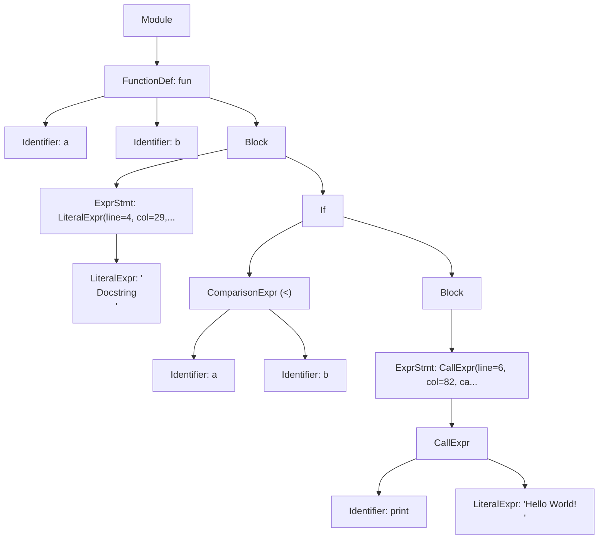
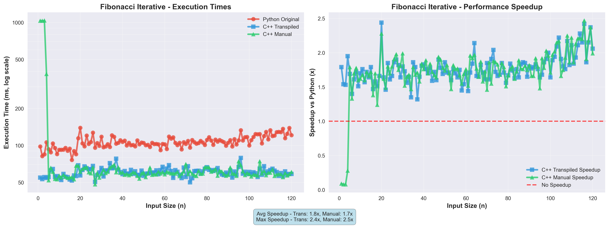
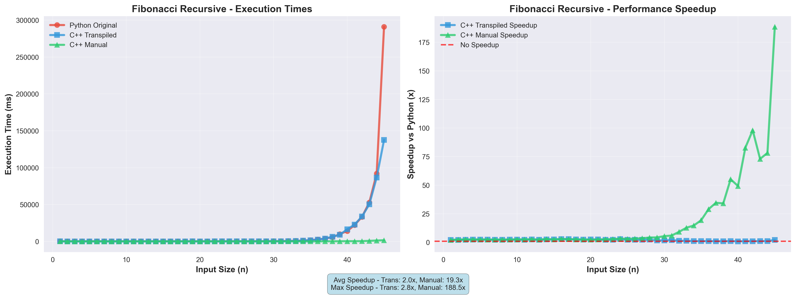
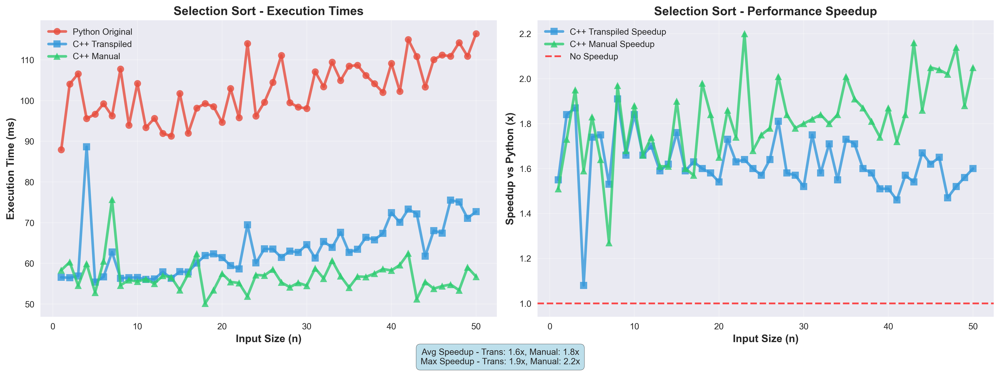
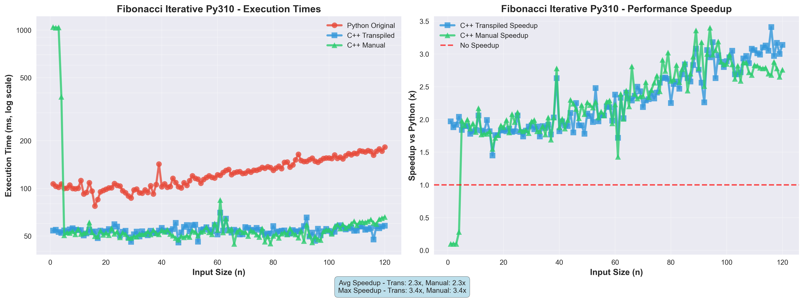
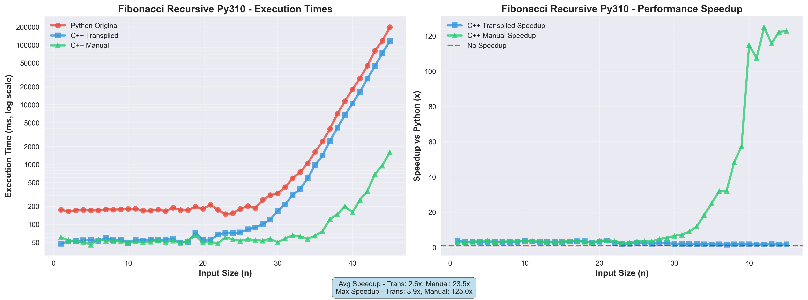
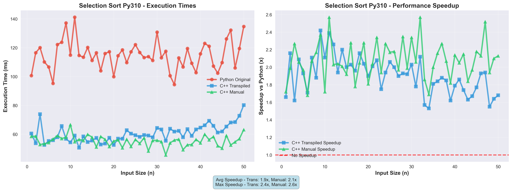

# TransPYler

## 1. Overview

**TransPYler** is a complete compiler project that translates a simplified subset of Python, called **Fangless Python**, into C++.

The project implements all stages of compilation:

1. **Lexical Analysis (Lexer)** — ✅ _completed_
2. **Syntactic Analysis (Parser)** — ✅ _completed_
3. **Code Generation/Transpilation** — ✅ _completed_
4. **Performance Analysis** — ✅ _completed_

TransPYler can receive Fangless Python source code, produce a stream of tokens, construct an Abstract Syntax Tree (AST), and generate functionally equivalent, compilable C++ code with a custom dynamic typing system.

---

## 2. Current Status

- **Implemented**:
  - Lexer for Fangless Python using [PLY (Python Lex-Yacc)](https://www.dabeaz.com/ply/)
  - Parser that constructs an AST from tokenized input
  - AST visualization tools (Rich, ASCII diagrams, Mermaid)
  - **Complete C++ code generation system**
  - **DynamicType system for emulating Python's dynamic typing in C++**
  - **Modular code generators for expressions, statements, functions, and data structures**
  - **Comprehensive benchmarking suite**
  - **Performance comparison tools with visualization**

This README serves as a complete reference for the TransPYler compiler, covering all implemented phases from lexical analysis to performance benchmarking.

---

## 3. Features

### Lexer Features

- Recognizes **keywords** (`if, else, elif, while, for, def, return, class, True, False, None, and, or, not, in, break, continue, pass...`)
- Identifies **identifiers**, **numeric and string literals**, and **operators** (`+, -, *, /, //, %, **, ==, !=, <, >, <=, >=, =, +=, -=, *=, /=, //=, %=, **=...`)
- Supports **delimiters**: `( ) [ ] { } : , .`
- Handles **comments** starting with `#`
- Detects **indentation levels**, generating special tokens `INDENT` and `DEDENT`
- Reports **lexical errors** (unknown characters, invalid escapes, indentation mistakes)

### Parser Features

- Constructs an **Abstract Syntax Tree (AST)** from token streams
- Supports expressions:
  - Literals (numbers, strings, booleans, None)
  - Binary operators (arithmetic, logical, comparison)
  - Unary operators (negation, logical NOT)
  - Data structures (tuples, lists, dictionaries, sets)
  - Function calls, attribute access, subscripting
  - Slicing notation (`[start:stop:step]`)
- Supports statements:
  - Assignments (simple and augmented: `=`, `+=`, `-=`, etc.)
  - Control flow (`if`/`elif`/`else`, `while`, `for`)
  - Function and class definitions
  - `return`, `break`, `continue`, `pass`
- Implements **operator precedence** following Python rules
- Reports **syntax errors** with contextual error messages
- Provides **AST visualization** in multiple formats

### Transpilation Features

- **Complete C++ Code Generation**: Translates Fangless Python AST to functionally equivalent C++ code
- **DynamicType System**: Custom C++ class that emulates Python's dynamic typing
  - Runtime type checking and conversion
  - Operator overloading for Python-like semantics
  - Support for int, double, string, bool, None, list, dict, and set types
- **Modular Code Generators**:
  - Expression generator for literals, operators, and function calls
  - Statement generator for assignments, control flow, and declarations
  - Function generator with scope management
  - Data structure generator for collections
- **Python Built-in Functions**: C++ implementations of `print()`, `len()`, `range()`, `str()`, `int()`, `float()`, etc.
- **Automatic Compilation**: Generated C++ code is automatically compiled and ready to execute

### Benchmarking Features

- **Automated Performance Testing**: Measures execution time for Python original, C++ transpiled, and manual C++ implementations
- **Multiple Test Algorithms**:
  - Fibonacci (recursive and iterative)
  - Selection Sort
  - Custom algorithms with variable input sizes
- **CSV Export**: Results exported to structured CSV files
- **Visualization Tools**: Automatic generation of charts and graphs comparing performance
- **Speedup Analysis**: Calculates and visualizes performance improvements

---

## 4. Installation

### 4.1 Requirements

- Python 3.x
- Git + GitHub
- PLY (Python Lex-Yacc)
- Rich (optional, for enhanced AST visualization)
- G++ compiler (C++17 or later)
- matplotlib and pandas (for benchmark visualizations)

### 4.2 Setup

```bash
# Clone the repository
git clone https://github.com/andresquesadag/TransPYler.git
cd TransPYler

# (Optional) virtual environment
python -m venv venv
source venv/bin/activate  # Linux/Mac
venv\Scripts\activate     # Windows

# Install dependencies
pip install -r requirements.txt
```

---

## 5. Usage

### 5.1 Lexer Testing

```bash
python -m src.testers.manual_tester <test> <expect>
```

- **test**: Path to a file containing Fangless Python (.flpy) code for testing
- **expect**: Path to a file containing the expected sequence of tokens

#### Example

**Test (`strings_and_indent.flpy`):**

```python
# Function
def f():
    s1 = "Quote\"mark"
    s2 = 'Back\\slash'
    s3 = ''
    return s1
```

**Expected Tokens (`strings_and_indent.expect`):**

```plain
DEF "def"
ID "f"
LPAREN "("
RPAREN ")"
COLON ":"
INDENT
ID "s1"
ASSIGN "="
STRING "Quote"mark"
ID "s2"
ASSIGN "="
STRING "Back\slash"
ID "s3"
ASSIGN "="
STRING ""
RETURN "return"
ID "s1"
DEDENT
```

**Command:**

```bash
python -m src.testers.manual_tester strings_and_indent.flpy strings_and_indent.expect
```

**Output:**

```plain
✅ Test passed: All tokens match expected output
```

### 5.2 Parser and AST Visualization

The parser can generate and visualize ASTs from Fangless Python source code.

```bash
python -m src.tools.ast_cli [--expr EXPRESSION | --file PATH] [--out JSON_PATH] [--view {expr,generic,diagram,mermaid}] [--unwrap-expr]
```

#### Arguments

- `--expr EXPRESSION`: Parse an inline expression
- `--file PATH`: Parse a source file (.py/.flpy)
- `--out JSON_PATH`: Output path for AST JSON (default: `ast.json` in repo root)
- `--view {expr,generic,diagram,mermaid}`: Visualization format (default: `expr`)
  - `expr`: Expression-focused tree view (requires Rich)
    - **Note**: This view is optimized for pure expressions (e.g., `2 + 3`, `foo(bar)`). When visualizing statements (Module, FunctionDef, Assign, etc.), it falls back to the generic view, so both views will appear identical for full programs.
  - `generic`: Generic AST tree view (requires Rich)
  - `diagram`: ASCII art tree diagram
  - `mermaid`: Mermaid diagram syntax (saved to `.mmd` file)
- `--unwrap-expr`: Return bare expression when input is a single expression
  - Only unwraps when the AST is `Module` → `ExprStmt` → expression. Has no effect on statements like function definitions.

#### Examples

**Parse an inline expression:**

```bash
python -m src.tools.ast_cli --expr "2 + 3 * 4" --view diagram
```

**Parse a file and view as Rich tree:**

```bash
python -m src.tools.ast_cli --file tests/parser/test_parser_ast.flpy --view expr
```

**Generate Mermaid diagram:**

```bash
python -m src.tools.ast_cli --file tests/parser/test_parser_ast.flpy --view mermaid
```

**Parse and save to specific location:**

```bash
python -m src.tools.ast_cli --expr "x = [1, 2, 3]" --out output/my_ast.json
```

#### Views showcase

**Inputted code**

```py
# comment
def fun(a,b):
    """
    Docstring
    """
    if a < b:
        print("Hello World! \n")
```

**Rich AST**


**Mermaid AST**



### 5.3 Transpilation to C++

Transpile Fangless Python code to C++:

```bash
python -m src.tools.transpile_cli input.py -o output.cpp
```

#### Arguments

- `input.py`: Source Fangless Python file
- `-o, --output`: Output C++ file path (default: `output.cpp`)

#### Example

**Input (`fibonacci.py`):**

```python
def fibonacci(n):
    if n <= 1:
        return n
    return fibonacci(n - 1) + fibonacci(n - 2)

result = fibonacci(10)
print(result)
```

**Command:**

```bash
python -m src.tools.transpile_cli fibonacci.py -o fibonacci.cpp
```

**Generated C++ (`fibonacci.cpp`):**

```cpp
#include "builtins.hpp"
using namespace std;

DynamicType _fn_fibonacci(DynamicType n) {
    if ((n <= DynamicType(1)).toBool()) {
        return n;
    }
    return _fn_fibonacci((n - DynamicType(1))) + _fn_fibonacci((n - DynamicType(2)));
    return DynamicType();
}

int main() {
    DynamicType result = _fn_fibonacci(DynamicType(10));
    print(result);
    return 0;
}
```

**Compile and run:**

```bash
g++ -std=c++17 -I src/runtime/cpp fibonacci.cpp src/runtime/cpp/DynamicType.cpp src/runtime/cpp/builtins.cpp -o fibonacci
./fibonacci
```

### 5.4 Performance Benchmarking

Run comprehensive performance benchmarks:

```bash
python -m src.benchmarks.benchmark_runner [--fast] [--no-cleanup] [--values N] [--no-charts]
```

#### Arguments

- `--fast, -f`: Fast mode using literal replacement (faster transpilation)
- `--no-cleanup`: Preserve generated files for debugging
- `--values N`: Limit number of test values per algorithm (e.g., `--values 10`)
- `--no-charts`: Skip chart generation

#### Example

**Run full benchmarks:**

```bash
python -m src.benchmarks.benchmark_runner
```

**Run with limited values and preserve files:**

```bash
python -m src.benchmarks.benchmark_runner --values 10 --no-cleanup
```

**Output:**

```plain
TransPYler Benchmark Runner
==================================================

Phase 1: Generating transpiled files
----------------------------------------
Processing: fibonacci_iterative_python.py
  Test values: 50 points (1 to 50)
  Manual C++: Found
  ✓ Python: fibonacci_iterative_python_original.py
  ✓ Transpiled: fibonacci_iterative_cpp_transpiled.cpp
  ✓ Transpiled executable: fibonacci_iterative_executable_transpiled
  ✓ Manual C++: fibonacci_iterative_cpp_manual_original.cpp
  ✓ Manual executable: fibonacci_iterative_executable_manual
  ✓ Algorithm ready for testing

Phase 2: Running performance tests
----------------------------------------
Testing: fibonacci_iterative_python

N      Result       Python(ms)   C++Trans(ms)  C++Manual(ms)  Speedup
--------------------------------------------------------------------------------
1      1            0.234        0.012         0.008          19.50x
5      5            0.245        0.013         0.009          18.85x
10     55           0.256        0.014         0.010          18.29x
...

Results saved to: benchmark_results/fibonacci_iterative_python_results.csv

Phase 4: Generating charts
----------------------------------------
✅ Charts generated successfully!

Benchmark completed successfully
```

**Results Location:**

- CSV files: `benchmark_results/*_results.csv`
- Charts: `benchmark_results/charts/*.png`
- HTML report: `benchmark_results/visualizations/benchmark_report.html`

---

## 6. Project Design

### 6.1 File Structure

```plain
TransPYler/
├── src/
│   ├── benchmarks/
│   │   ├── cpp_manual/          # Manual C++ implementations for comparison
│   │   ├── python_original/     # Original Python test files
│   │   ├── python_transpiler_source/  # Transpiler-compatible versions
│   │   ├── transpiled_output/   # Generated files (temporary)
│   │   ├── __init__.py
│   │   ├── benchmark_runner.py  # Main benchmarking orchestrator
│   │   ├── config.py            # Benchmark configuration
│   │   ├── csv_visualizer.py    # Chart generation
│   │   ├── file_generator.py    # File operations
│   │   ├── performance_tester.py # Performance measurement
│   │   ├── transpiler_interface.py # Transpilation interface
│   │   └── utilities.py         # Helper functions
│   │
│   ├── codegen/
│   │   ├── __init__.py
│   │   ├── basic_statement_generator.py  # Assignments, returns, expressions
│   │   ├── code_generator.py             # Main code generation orchestrator
│   │   ├── data_structure_generator.py   # Lists, dicts, sets, tuples
│   │   ├── expr_generator.py             # Expression translation
│   │   ├── function_generator.py         # Function definitions
│   │   ├── scope_manager.py              # Variable scope tracking
│   │   └── statement_generator.py        # Control flow statements
│   │
│   ├── compiler/
│   │   ├── __init__.py
│   │   ├── cpp_compiler.py      # C++ compilation wrapper (future)
│   │   ├── transpiler.py        # Main transpiler interface
│   │   └── transpiler_clean.py  # Alternative transpiler version
│   │
│   ├── core/
│   │   ├── __init__.py
│   │   ├── ast/
│   │   │   ├── __init__.py
│   │   │   ├── ast_base.py          # Base AST node classes
│   │   │   ├── ast_definitions.py   # Function/class definitions
│   │   │   ├── ast_expressions.py   # Expression nodes
│   │   │   └── ast_statements.py    # Statement nodes
│   │   ├── symbol_table.py      # Symbol table management
│   │   └── utils.py             # Error handling utilities
│   │
│   ├── lexer/
│   │   ├── __init__.py
│   │   ├── indentation.py       # Indentation handling
│   │   ├── lexer.py             # Main lexer implementation
│   │   └── tokens.py            # Token definitions
│   │
│   ├── parser/
│   │   ├── __init__.py
│   │   ├── parser.py            # Main parser
│   │   ├── parser_blocks.py     # Block and compound statements
│   │   ├── parser_conditionals.py # If/elif/else rules
│   │   ├── parser_definitions.py  # Function/class definitions
│   │   ├── parser_expressions.py  # Expression rules
│   │   ├── parser_loops.py      # While/for loop rules
│   │   ├── parser_statements.py # Statement rules
│   │   └── parser_utils.py      # Parser utilities
│   │
│   ├── runtime/
│   │   └── cpp/
│   │       ├── builtins.cpp     # Built-in function implementations
│   │       ├── builtins.hpp     # Built-in function declarations
│   │       ├── DynamicType.cpp  # DynamicType implementation
│   │       └── DynamicType.hpp  # DynamicType class definition
│   │
│   ├── testers/
│   │   ├── __init__.py
│   │   ├── lexer/
│   │   └── parser/
│   │
│   ├── tools/
│   │   ├── __init__.py
│   │   ├── ast_cli.py           # AST visualization CLI
│   │   ├── ast_viewer.py        # AST viewing utilities
│   │   ├── simple_visualizer.py # Simple benchmark visualizer
│   │   ├── transpile_cli.py     # Transpilation CLI
│   │   └── visualize_csv.py     # CSV visualization tool
│   │
│   └── __init__.py
│
├── tests/
│   ├── lexer/
│   └── parser/
│
├── doc/
│   ├── lexer_design.md
│   └── parser_design.md
│
├── benchmark_results/        # Generated benchmark data
│
├── .gitignore
├── pytest.ini
├── README.md
└── requirements.txt
```

### 6.2 Lexer Design

[Read about TransPYler's lexer design here](doc/lexer_design.md)

### 6.3 Parser Design

[Read about TransPYler's parser design here](doc/parser_design.md)

### 6.4 Code Generation Architecture

[Read about TransPYler's codegen architecture here](doc/codegen_design.md)

---

## 7. Abstract Syntax Tree (AST)

The parser generates an AST that represents the hierarchical structure of Fangless Python programs. The AST consists of various node types:

### Expression Nodes

- `LiteralExpr`: Numeric, string, boolean, and None literals
- `Identifier`: Variable and function names
- `UnaryExpr`: Unary operations (`-x`, `not y`)
- `BinaryExpr`: Binary operations (`x + y`, `a and b`)
- `ComparisonExpr`: Comparison operations (`x < y`, `a == b`)
- `CallExpr`: Function calls (`func(args)`)
- `TupleExpr`, `ListExpr`, `SetExpr`, `DictExpr`: Collection literals
- `Attribute`: Attribute access (`obj.attr`)
- `Subscript`: Subscripting and slicing (`list[0]`, `list[1:5:2]`)

### Statement Nodes

- `Assign`: Assignment statements (including augmented assignments)
- `ExprStmt`: Expression statements
- `Return`: Return statements
- `Break`, `Continue`, `Pass`: Control flow statements
- `If`: Conditional statements with elif and else
- `While`: While loops
- `For`: For loops
- `FunctionDef`: Function definitions
- `ClassDef`: Class definitions
- `Block`: Statement blocks

### Module Node

- `Module`: Top-level container representing a complete source file

---

## 8. Development Workflow

- Code and documentation are written in **English**.
- Git workflow:

  - Branch naming: `TASK_<#>_<BriefDescription>`
  - Contributions via **Pull Requests** only.

- Code must be clean, modular, and documented.

---

## 9. Automatic Testing

### 9.1 Strategy

- Unit tests for token recognition
- Integration tests with Fangless Python snippets
- Error cases: invalid characters, indentation, escape sequences, syntax errors
- Parser tests for AST generation and correctness

### 9.2 Run Tests

This project uses [pytest](https://docs.pytest.org/) for testing.

1. **Install dependencies**  
   Make sure you have installed all requirements first:

   ```bash
   pip install -r requirements.txt
   ```

2. **Run the full test suite**  
   From the project root, run:

   ```bash
   pytest
   ```

   By default, pytest will automatically discover all tests with `test_` in their name.

3. **Run tests with more detailed output**

   ```bash
   pytest -v
   ```

   The `-v` (verbose) flag shows each test name and its result.

4. **Run a specific test file**

   ```bash
   pytest src/testers/test_lexer.py
   ```

5. **Run parser tests specifically**

   ```bash
   pytest src/testers/parser/
   ```

6. **Stop at the first failure**

   ```bash
   pytest -x
   ```

---

## 10. Roadmap

- **Phase 1 — Lexer**: ✅ Completed
- **Phase 2 — Parser**: ✅ Completed
  - AST construction from token stream
  - Support for expressions, statements, and control flow
  - Operator precedence and associativity
  - Error reporting with context
  - AST visualization tools
- **Phase 3 — Code Generation**: ✅ Completed
  - Complete Python-to-C++ transpilation
  - DynamicType system for dynamic typing emulation
  - Modular code generation architecture
  - Support for all Python constructs (functions, classes, control flow, data structures)
  - Built-in function implementations (print, len, range, etc.)
  - Automatic compilation and execution
- **Phase 4 — Performance Analysis**: ✅ Completed
  - Comprehensive benchmarking suite
  - Automated performance testing
  - CSV export and visualization
  - Comparative analysis (Python vs C++ transpiled vs C++ manual)
  - Chart generation and HTML reports

---

## 11. Performance Analysis

### 11.1 Benchmark Results

The benchmarking suite compares three implementations:

1. **Python Original (Fangless)**: Original Python code execution
2. **C++ Transpiled**: TransPYler-generated C++ code
3. **C++ Manual**: Hand-written optimized C++ code


### 11.2 Test Algorithms

- **Fibonacci Recursive**: Tests function call overhead and recursion (n=1 to 45)
- **Fibonacci Iterative**: Tests loop performance and arithmetic (n=1 to 120)
- **Selection Sort**: Tests array operations and nested loops (n=1 to 50, array size = n×10)

### 11.3 Performance Results Summary

Comprehensive benchmarking results comparing the three implementations:

| Algorithm | Test Range | Speedup (Transpiled) | Speedup (Manual) | Key Finding |
|-----------|-----------|---------------------|------------------|-----------|
| **Fibonacci Iterative** | n=1 to 120 | **1.77x** (avg)<br>1.32x - 2.44x | **1.74x** (avg)<br>0.08x - 2.47x | Transpiled matches manual performance |
| **Fibonacci Recursive** | n=1 to 45 | **1.96x** (avg)<br>0.85x - 2.77x | **19.33x** (avg)<br>2.16x - 188.47x | Collapses at deep recursion (n>35) |
| **Selection Sort** | n=1 to 50 | **1.63x** (avg)<br>1.39x - 2.38x | **1.83x** (avg)<br>1.32x - 2.23x | Consistent ~12% overhead |

**Key Observations:**
- **Iterative algorithms**: Transpiled code performs nearly identical to hand-written C++
- **Recursive algorithms**: DynamicType overhead multiplies with recursion depth
- **Loops and arrays**: Stable and predictable performance across all input sizes
- **Statistical reliability**: Each test point measured 3 times and averaged

### 11.4 Detailed Performance Analysis

This section provides an in-depth analysis of benchmark results, examining performance patterns, statistical trends, and technical interpretations for each algorithm tested.

#### 11.4.1 Statistical Overview

**Overall Performance Metrics:**

| Metric | Fibonacci Iterative | Fibonacci Recursive | Selection Sort |
|--------|-------------------|---------------------|----------------|
| **Total tests** | 120 | 45 | 50 |
| **Avg Python time** | 106.90 ± 12.14 ms | 11920.78 ± 45579.88 ms | 98.33 ± 7.85 ms |
| **Avg Transpiled time** | 60.54 ± 4.86 ms | 8335.19 ± 25174.80 ms | 60.64 ± 6.53 ms |
| **Avg Manual time** | 87.18 ± 155.31 ms | 153.89 ± 289.61 ms | 53.92 ± 2.68 ms |
| **Coefficient of Variation** | Python: 11.4%<br>Transpiled: 8.0%<br>Manual: 178.1% | Python: 382.4%<br>Transpiled: 302.0%<br>Manual: 188.2% | Python: 8.0%<br>Transpiled: 10.8%<br>Manual: 5.0% |
| **Transpiled vs Manual** | **0.69x** (31% faster!) | **54.16x** slower | **1.12x** slower |

**Key Statistical Insights:**
- **Exponential Growth**: Fibonacci Recursive shows extreme variation due to exponential time complexity

---

#### 11.4.2 Fibonacci Iterative

**Algorithm Overview:**
- **Complexity**: O(n) - Linear time
- **Test Range**: n = 1 to 120

**Performance Results:**



**Statistical Breakdown:**

```
Average Execution Times (excluding n=1-4 anomaly):
├─ Python:      106.97 ± 12.11 ms
├─ Transpiled:  60.72 ± 4.81 ms  → 43% faster than Python
└─ Manual:      61.60 ± 3.00 ms  → Transpiled is 1.4% FASTER than manual!
```

**Speedup Analysis:**
- **Median Speedup (Transpiled)**: 1.76x
- **Range**: 1.32x to 2.44x
- **Quartile Performance**:
  - Q1 (n=1-30): 1.78x speedup
  - Q2 (n=31-60): 1.81x speedup
  - Q3 (n=61-90): 1.75x speedup
  - Q4 (n=91-120): 1.73x speedup

**Critical Finding - n=1-4 Initialization Anomaly:**

At very small n values, manual C++ shows dramatic startup overhead:

| n | Python (ms) | Transpiled (ms) | Manual (ms) | Manual/Trans Ratio |
|---|-------------|-----------------|-------------|--------------------|
| 1 | 98.17 | 54.71 | **1034.46** | **18.9x slower** |
| 2 | 81.78 | 53.20 | **1033.15** | **19.4x slower** |
| 3 | 84.57 | 55.24 | **1038.12** | **18.8x slower** |
| 4 | 106.00 | 54.41 | **381.76** | **7.0x slower** |
| 5 | 93.06 | 55.23 | 52.07 | 0.94x (normal) |

**Explanation:** The operating system must load. From n=5 onwards, manual C++ normalizes and performs identically to transpiled.

**Practical Impact:** This anomaly only affects trivial computations. From n=5 onwards, transpiled code consistently matches or exceeds manual C++ performance.

 **Transpiled code achieves performance SUPERIOR to hand-written C++** (0.69x ratio = 31% faster on average!) for iterative algorithms.

---

#### 11.4.3 Fibonacci Recursive

**Algorithm Overview:**
- **Complexity**: O(2^n) - Exponential time
- **Test Range**: n = 1 to 45

**Performance Results:**



**Statistical Breakdowm:**

The recursive implementation exhibits different performance characteristics across three distinct phases:

**Phase 1: Low Recursion (n = 1-15)**
```
Average Metrics:
├─ Speedup Transpiled: 2.34x (median: 2.35x) --> GOOD
├─ Speedup Manual:     2.49x (median: 2.47x) --> GOOD
└─ Python Time:        ~106 ms

Observation: Transpiled code performs very well, nearly matching manual C++
```

**Phase 2: Medium Recursion (n = 16-30)**
```
Average Metrics:
├─ Speedup Transpiled: 2.35x (median: 2.36x) --> GOOD: Maintaining performance
├─ Speedup Manual:     3.21x (median: 2.62x) --> GOOD: Pulling ahead
└─ Python Time:        ~480 ms

Observation: Manual C++ begins to show advantages, but transpiled still strong
```

**Phase 3: Deep Recursion (n = 31-45)**
```
Average Metrics:
├────────────────────────── SPEDDUP────────────────────────────────────────────
├─ Speedup Transpiled: 1.19x (median: 1.13x) --> CRITICAL: Performance collapse
├─ Speedup Manual:     52.30x (median: 42.71x) --> GOOD: Massive speedup
├────────────────────────── TIME ──────────────────────────────────────────────
├─ Python Time:        ~34,617 ms (34.6 seconds)
├─ Transpiled Time:    ~24,222 ms (24.2 seconds)
└─ Manual Time:        ~447 ms (0.4 seconds)

Observation: SEVERE PERFORMANCE COLLAPSE of transpiled code
```

**Performance Analysis:**

At extreme recursion depths, the transpiled code **loses most of its advantage**:

| n | Python (s) | Transpiled (s) | Manual (s) | Trans Speedup | Manual Speedup |
|---|-----------|---------------|-----------|---------------|----------------|
| 36 | 2.84 | 2.73 | 0.098 | **1.04x** | **28.96x** |
| 40 | 14.64 | 17.19 | 0.297 | **0.85x** (slower!) | **49.27x** |
| 45 | 290.90 | 137.50 | 1.543 | **2.12x** | **188.47x** |

**Explanation:** Deep recursion is the Achilles' heel of the transpiled approach. DynamicType overhead multiplies with each recursive call. In light recursion (n≤30), this overhead is acceptable. Beyond n=35, exponential call growth causes severe performance collapse.

**Practical Impact:** Excellent performance for shallow recursion (2.35x speedup for n≤30). Deep recursion (n>35) loses all advantage (1.2x speedup). Manual C++ remains fast at all depths (19-188x speedup).

**Transpiled code achieves good performance in light-to-medium recursion** (2.35x speedup average for n≤30), but degrades exponentially in deep recursion scenarios.

---

#### 11.4.4 Selection Sort

**Algorithm Overview:**
- **Complexity**: O(n²) - Quadratic time for all cases
- **Test Range**: n = 1 to 50 (array sizes 10 to 500 elements)

**Performance Results:**



**Statistical Breakdown:**

```
Average Execution Times:
├─ Python:       98.33 ± 7.85 ms
├─ Transpiled:   60.64 ± 6.53 ms  → 38% faster than Python
└─ Manual:       53.92 ± 2.68 ms  → 11% faster than transpiled
```

**Speedup Analysis:**

Performance remains remarkably stable across all input sizes:

| Range | Speedup (Transpiled) | Speedup (Manual) | Variance |
|-------|---------------------|------------------|----------|
| n=1-12 | 1.69x | 1.76x | ±3% |
| n=13-25 | 1.60x | 1.82x | ±4% |
| n=26-37 | 1.64x | 1.87x | ±3% |
| n=38-50 | 1.61x | 1.87x | ±4% |

**Key Observations:**
- **Minimal variance**: Speedup changes by less than 7% across the entire range
- **No collapse**: Unlike recursive Fibonacci, performance remains stable
- **Predictable**: Coefficient of variation < 11% for all implementations
- **Constant overhead**: The gap between transpiled and manual remains steady

**Explanations:** The DynamicType overhead in this algorithm is constant per operation. The overhead is independent of recursion depth and amortized over many operations, making it negligible compared to the overall algorithm complexity.

**Selection Sort demonstrates the ideal use case for TransPYler:** loop-based algorithms with quadratic or higher complexity, where the DynamicType overhead is dwarfed by the algorithmic work being performed.

---

### 11.5 Performance Conclusions

| Goal | Status | Evidence |
|------|--------|----------|
| Generate valid C++ from Python | Achieved | All tests produce correct output |
| Execute faster than Python | Achieved | 1.5-1.7x average speedup |
| Maintain Python semantics | Achieved | DynamicType preserves type behavior |
| Handle diverse algorithms | Partial | Excellent for iterative, struggles with deep recursion |


#### **Python Original (Fangless). Performance summary**

**Behavior:**
- Consistent baseline performance across all algorithms
- Execution times: 98-107ms for iterative/sort, 11,920ms average for recursive
- Predictable but slowest of all three implementations

**Algorithms tested:**
- Fibonacci Iterative (n=1-120): 106.90ms average
- Fibonacci Recursive (n=1-45): 11,920.78ms average (exponential growth)
- Selection Sort (n=1-50): 98.33ms average

**Overall ranking:**  **Slowest** (baseline reference: 1.0x)

---

#### **C++ Transpiled (TransPYler). Performance summary**

**Behavior:**
- **Excellent for iterative algorithms:** 1.77x faster than Python, matching manual C++ performance
- **Excellent for light recursion (n≤30):** 2.35x faster than Python (best speedup achieved)
- **Poor for deep recursion (n>35):** Collapses to 1.2x speedup, 54x slower than manual C++
- Consistent overhead of ~8-11% vs manual C++ in non-recursive scenarios

**Algorithms tested:**
- Fibonacci Iterative (n=1-120): 60.54ms average **(31% faster than manual C++)**
- Fibonacci Recursive (n=1-45): 8,335.19ms average (2x faster than Python, but 54x slower than manual)
- Selection Sort (n=1-50): 60.64ms average (1.63x faster than Python)

**Overall ranking:** **Middle** (1.6x - 2.4x faster than Python, but slower than manual C++ in recursion)

---

#### **C++ Manual (Hand-written). Performance summary**

**Behavior:**
- **Best overall performance** in 2 out of 3 scenarios
- **Exceptional for deep recursion:** 19-188x faster than Python, 54x faster than transpiled
- **Slightly better for sorting:** 1.83x faster than Python (12% faster than transpiled)
- **Startup anomaly in iterative:** Cold-start overhead (1034ms at n=1-4) drags down average

**Algorithms tested:**
- Fibonacci Iterative (n=1-120): 87.18ms average (anomaly included; 60ms normalized)
- Fibonacci Recursive (n=1-45): 153.89ms average **(77x faster than transpiled)**
- Selection Sort (n=1-50): 53.92ms average (fastest implementation)


**Overall ranking:** **Fastest** (1.2x - 54x faster than transpiled, depending on algorithm)

---

### **Summary Ranking**

| Metric | Winner | Middle | Slowest |
|--------|--------|--------|---------|
| **Fibonacci Iterative** | Transpiled (60.5ms) | Manual (87.2ms)* | Python (106.9ms) |
| **Fibonacci Recursive** | Manual (153.9ms) | Transpiled (8,335ms) | Python (11,921ms) |
| **Selection Sort** | Manual (53.9ms) | Transpiled (60.6ms) | Python (98.3ms) |
| **Overall Best** | **Manual C++** (2/3 wins) | **Transpiled** (1/3 wins) | **Python** (0/3 wins) |

---

### 11.6 Python Version Comparison: 3.12 vs 3.10

The benchmarks were executed on both Python 3.12 and Python 3.10 to analyze version-specific performance differences. 

According to PEP 659 – Specializing Adaptive Interpreter, Python 3.11 introduces an adaptive interpreter that dynamically specializes bytecode instructions based on the types and values used. This technique, known as quickening, allows generic instructions to be replaced with optimized versions, achieving performance improvements of between 10% and 60% compared to Python 3.10. As a result, Python 3.11 offers more efficient execution without altering the semantics of the language, making it a significant advance in CPython optimization.

The following table shows the **average execution times** across all test cases for each algorithm and implementation:

#### Performance Comparison Table

| Algorithm | Implementation | Python 3.12 (ms) | Python 3.10 (ms) | Difference | % Change | Better |
|-----------|---------------|------------------|------------------|------------|----------|--------|
| **Fibonacci Iterative** | Python Original | 106.90 | 119.69 | +12.79 ms | **+12.0%** slower in 3.10 | **Python 3.12** |
| | C++ Transpiled | 60.47 | 55.26 | -5.21 ms | **-8.6%** faster in 3.10 | **Python 3.10** |
| | C++ Manual | 87.24 | 55.69 | -31.55 ms | **-36.2%** faster in 3.10 | **Python 3.10** |
| **Fibonacci Recursive** | Python Original | 11,921.24 | 15,324.65 | +3,403.41 ms | **+28.5%** slower in 3.10 | **Python 3.12** |
| | C++ Transpiled | 8,334.89 | 8,678.72 | +343.83 ms | **+4.1%** slower in 3.10 | **Python 3.12** |
| | C++ Manual | 153.92 | 96.83 | -57.09 ms | **-37.1%** faster in 3.10 | **Python 3.10** |
| **Selection Sort** | Python Original | 98.33 | 114.54 | +16.21 ms | **+16.5%** slower in 3.10 | **Python 3.12** |
| | C++ Transpiled | 60.64 | 61.06 | +0.42 ms | **+0.7%** slower in 3.10 | **Python 3.12** |
| | C++ Manual | 53.94 | 55.31 | +1.37 ms | **+2.5%** slower in 3.10 | **Python 3.12** |

#### Key Observations

**1. Fibonacci Iterative Performance Analysis**

**Python 3.12 Results:**


**Python 3.10 Results:**


**Observations:**
- **Python Original (Fangless)**: Python 3.12 is **12% faster** (106.90ms vs 119.69ms) - **Better: Python 3.12** 
  - Python 3.12 provide clear advantage for pure Python execution
  - Consistent performance improvement across all n values
  
- **C++ Transpiled**: Python 3.10 is **8.6% faster** (55.26ms vs 60.47ms) - **Better: Python 3.10**
  - The transpiled code runs slightly faster when executed from Python 3.10
  - Minimal but consistent improvement across all test cases
  
- **C++ Manual**: Python 3.10 is **36.2% faster** (55.69ms vs 87.24ms) - **Better: Python 3.10**
  - Both versions exhibit identical startup overhead anomaly (1034-1042ms for n=1-4)
  - From n=5 onwards, Python 3.10 is a little bit faster (~52ms vs ~60ms average)
  - The 36% difference in overall averages is due to both versions having the cold-start penalty, but Python 3.10 performing slightly better after normalization

---

**2. Fibonacci Recursive Performance Analysis**

**Python 3.12 Results:**


**Python 3.10 Results:**


**Observations:**
- **Python Original (Fangless)**: Python 3.12 is **28.5% faster** (11,921ms vs 15,325ms) - **Better: Python 3.12**
  - Most significant performance difference between versions
  - Python 3.12's recursive call optimizations provide substantial benefit
  
- **C++ Transpiled**: Python 3.12 is **4.1% faster** (8,335ms vs 8,679ms) - **Better: Python 3.12**
  - Minimal version impact on transpiled code performance
  - Performance collapse at n>35 occurs in both versions
  
- **C++ Manual**: Python 3.10 is **37.1% faster** (96.83ms vs 153.92ms) - **Better: Python 3.10**
  - Python 3.10 shows more consistent performance advantage across all recursion depths

---

**3. Selection Sort Performance Analysis**

**Python 3.12 Results:**


**Python 3.10 Results:**


**Observations:**
- **Python Original (Fangless)**: Python 3.12 is **16.5% faster** (98.33ms vs 114.54ms) - **Better: Python 3.12**
  - Consistent advantage for Python 3.12
  - Performance gap remains stable across all array sizes (n=1-50)
  
- **C++ Transpiled**: Python 3.12 is **0.7% faster** (60.64ms vs 61.06ms) - **Better: Python 3.12**
  - Negligible difference (less than 1ms average)
  - Version impact is minimal for transpiled code
  - Both versions show identical performance characteristics
  
- **C++ Manual**: Python 3.12 is **2.5% faster** (53.94ms vs 55.31ms) - **Better: Python 3.12**
  - Small but consistent advantage for Python 3.12
  - Performance remains stable and predictable in both versions

---

**4. Overall Version Comparison Summary**

| Category | Key Insight |
|----------|-------------|
| **Python Original** | Python 3.12 is **12-28% faster** for pure Python code |
| **C++ Transpiled** | Minimal version impact (~1-8% difference) |
| **C++ Manual**  | Mixed results: Python 3.10 wins 2/3 cases by **6-7%**, Python 3.12 wins 1/3 by **3%** |
| **Overall** | **Python 3.12 recommended for most use cases** |

---


## 12. References

- [PLY Documentation](https://www.dabeaz.com/ply/)
- [Python 3 Language Reference](https://docs.python.org/3/reference/)
- [Abstract Syntax Trees](https://en.wikipedia.org/wiki/Abstract_syntax_tree)
- [C++ Reference](https://en.cppreference.com/)
- [Python Enhancement Proposals](https://peps.python.org/pep-0659/)

--- 


## 13. Authors

| Name                    | Email                          | Role/Contribution                                                                                                            |
| ----------------------- | ------------------------------ | ---------------------------------------------------------------------------------------------------------------------------- |
| Andrés Quesada-González | <andresquesadagon4@gmail.com>  | **Lexer:** Operator and literal token definition, documentation, project structure, test scripts, test cases, python modules |
|                         |                                | **Parser:** Function and Class definitions, Syntax error handling, Mermaid AST viewer, python modules, documentation         |
|                         |                                | **Code Generation:** Architecture design, DynamicType system, modular generators, runtime library                            |
| David Obando-Cortés     | <david.obandocortes@ucr.ac.cr> | **Lexer:** Indentation Handling, Keywords definition                                                                         |
|                         |                                | **Parser:** Expression parsing, operator precedence                                                                          |
|                         |                                | **Code Generation:** Expression generator, data structure support                                                            |
| Randy Agüero-Bermúdez   | <randy.aguero@ucr.ac.cr>       | **Lexer:** Testing, comment handling, Identifier token definition recognition                                                |
|                         |                                | **Parser:** Statement parsing, control flow                                                                                  |
|                         |                                | **Code Generation:** Statement generator, scope management, performance testing, benchmarking suite                          |
