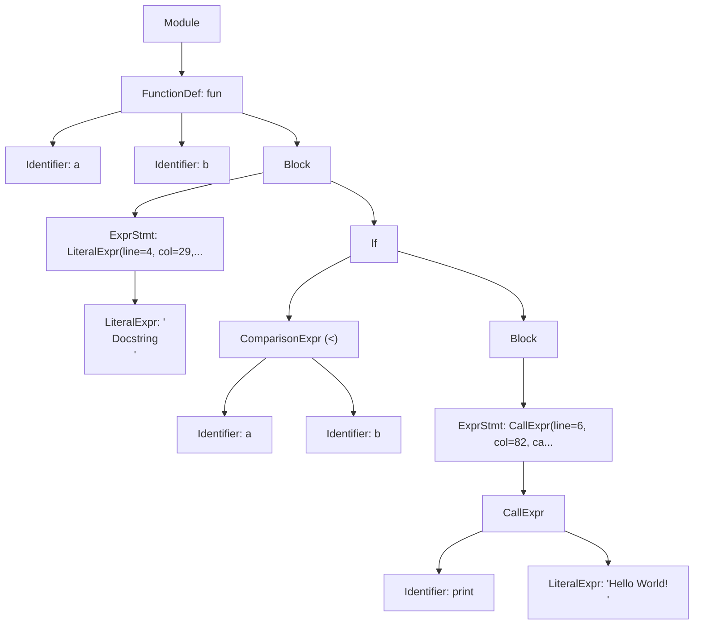

# TransPYler

## 1. Overview

**TransPYler** is a complete compiler project that translates a simplified subset of Python, called **Fangless Python**, into C++.

The project implements all stages of compilation:

1. **Lexical Analysis (Lexer)** — ✅ _completed_
2. **Syntactic Analysis (Parser)** — ✅ _completed_
3. **Code Generation/Transpilation** — ✅ _completed_
4. **Performance Analysis** — ✅ _completed_

TransPYler can receive Fangless Python source code, produce a stream of tokens, construct an Abstract Syntax Tree (AST), and generate functionally equivalent, compilable C++ code with a custom dynamic typing system.

---

## 2. Current Status

- **Implemented**:
  - Lexer for Fangless Python using [PLY (Python Lex-Yacc)](https://www.dabeaz.com/ply/)
  - Parser that constructs an AST from tokenized input
  - AST visualization tools (Rich, ASCII diagrams, Mermaid)
  - **Complete C++ code generation system**
  - **DynamicType system for emulating Python's dynamic typing in C++**
  - **Modular code generators for expressions, statements, functions, and data structures**
  - **Comprehensive benchmarking suite**
  - **Performance comparison tools with visualization**

This README serves as a complete reference for the TransPYler compiler, covering all implemented phases from lexical analysis to performance benchmarking.

---

## 3. Features

### Lexer Features

- Recognizes **keywords** (`if, else, elif, while, for, def, return, class, True, False, None, and, or, not, in, break, continue, pass...`)
- Identifies **identifiers**, **numeric and string literals**, and **operators** (`+, -, *, /, //, %, **, ==, !=, <, >, <=, >=, =, +=, -=, *=, /=, //=, %=, **=...`)
- Supports **delimiters**: `( ) [ ] { } : , .`
- Handles **comments** starting with `#`
- Detects **indentation levels**, generating special tokens `INDENT` and `DEDENT`
- Reports **lexical errors** (unknown characters, invalid escapes, indentation mistakes)

### Parser Features

- Constructs an **Abstract Syntax Tree (AST)** from token streams
- Supports expressions:
  - Literals (numbers, strings, booleans, None)
  - Binary operators (arithmetic, logical, comparison)
  - Unary operators (negation, logical NOT)
  - Data structures (tuples, lists, dictionaries, sets)
  - Function calls, attribute access, subscripting
  - Slicing notation (`[start:stop:step]`)
- Supports statements:
  - Assignments (simple and augmented: `=`, `+=`, `-=`, etc.)
  - Control flow (`if`/`elif`/`else`, `while`, `for`)
  - Function and class definitions
  - `return`, `break`, `continue`, `pass`
- Implements **operator precedence** following Python rules
- Reports **syntax errors** with contextual error messages
- Provides **AST visualization** in multiple formats

### Transpilation Features

- **Complete C++ Code Generation**: Translates Fangless Python AST to functionally equivalent C++ code
- **DynamicType System**: Custom C++ class that emulates Python's dynamic typing
  - Runtime type checking and conversion
  - Operator overloading for Python-like semantics
  - Support for int, double, string, bool, None, list, dict, and set types
- **Modular Code Generators**:
  - Expression generator for literals, operators, and function calls
  - Statement generator for assignments, control flow, and declarations
  - Function generator with scope management
  - Data structure generator for collections
- **Python Built-in Functions**: C++ implementations of `print()`, `len()`, `range()`, `str()`, `int()`, `float()`, etc.
- **Automatic Compilation**: Generated C++ code is automatically compiled and ready to execute

### Benchmarking Features

- **Automated Performance Testing**: Measures execution time for Python original, C++ transpiled, and manual C++ implementations
- **Multiple Test Algorithms**:
  - Fibonacci (recursive and iterative)
  - Selection Sort
  - Custom algorithms with variable input sizes
- **CSV Export**: Results exported to structured CSV files
- **Visualization Tools**: Automatic generation of charts and graphs comparing performance
- **Speedup Analysis**: Calculates and visualizes performance improvements

---

## 4. Installation

### 4.1 Requirements

- Python 3.x
- Git + GitHub
- PLY (Python Lex-Yacc)
- Rich (optional, for enhanced AST visualization)
- G++ compiler (C++17 or later)
- matplotlib and pandas (for benchmark visualizations)

### 4.2 Setup

```bash
# Clone the repository
git clone https://github.com/andresquesadag/TransPYler.git
cd TransPYler

# (Optional) virtual environment
python -m venv venv
source venv/bin/activate  # Linux/Mac
venv\Scripts\activate     # Windows

# Install dependencies
pip install -r requirements.txt
```

---

## 5. Usage

### 5.1 Lexer Testing

```bash
python -m src.testers.manual_tester <test> <expect>
```

- **test**: Path to a file containing Fangless Python (.flpy) code for testing
- **expect**: Path to a file containing the expected sequence of tokens

#### Example

**Test (`strings_and_indent.flpy`):**

```python
# Function
def f():
    s1 = "Quote\"mark"
    s2 = 'Back\\slash'
    s3 = ''
    return s1
```

**Expected Tokens (`strings_and_indent.expect`):**

```plain
DEF "def"
ID "f"
LPAREN "("
RPAREN ")"
COLON ":"
INDENT
ID "s1"
ASSIGN "="
STRING "Quote"mark"
ID "s2"
ASSIGN "="
STRING "Back\slash"
ID "s3"
ASSIGN "="
STRING ""
RETURN "return"
ID "s1"
DEDENT
```

**Command:**

```bash
python -m src.testers.manual_tester strings_and_indent.flpy strings_and_indent.expect
```

**Output:**

```plain
✅ Test passed: All tokens match expected output
```

### 5.2 Parser and AST Visualization

The parser can generate and visualize ASTs from Fangless Python source code.

```bash
python -m src.tools.ast_cli [--expr EXPRESSION | --file PATH] [--out JSON_PATH] [--view {expr,generic,diagram,mermaid}] [--unwrap-expr]
```

#### Arguments

- `--expr EXPRESSION`: Parse an inline expression
- `--file PATH`: Parse a source file (.py/.flpy)
- `--out JSON_PATH`: Output path for AST JSON (default: `ast.json` in repo root)
- `--view {expr,generic,diagram,mermaid}`: Visualization format (default: `expr`)
  - `expr`: Expression-focused tree view (requires Rich)
    - **Note**: This view is optimized for pure expressions (e.g., `2 + 3`, `foo(bar)`). When visualizing statements (Module, FunctionDef, Assign, etc.), it falls back to the generic view, so both views will appear identical for full programs.
  - `generic`: Generic AST tree view (requires Rich)
  - `diagram`: ASCII art tree diagram
  - `mermaid`: Mermaid diagram syntax (saved to `.mmd` file)
- `--unwrap-expr`: Return bare expression when input is a single expression
  - Only unwraps when the AST is `Module` → `ExprStmt` → expression. Has no effect on statements like function definitions.

#### Examples

**Parse an inline expression:**

```bash
python -m src.tools.ast_cli --expr "2 + 3 * 4" --view diagram
```

**Parse a file and view as Rich tree:**

```bash
python -m src.tools.ast_cli --file tests/parser/test_parser_ast.flpy --view expr
```

**Generate Mermaid diagram:**

```bash
python -m src.tools.ast_cli --file tests/parser/test_parser_ast.flpy --view mermaid
```

**Parse and save to specific location:**

```bash
python -m src.tools.ast_cli --expr "x = [1, 2, 3]" --out output/my_ast.json
```

#### Views showcase

**Inputted code**

```py
# comment
def fun(a,b):
    """
    Docstring
    """
    if a < b:
        print("Hello World! \n")
```

**Rich AST**


**Mermaid AST**



### 5.3 Transpilation to C++

Transpile Fangless Python code to C++:

```bash
python -m src.tools.transpile_cli input.py -o output.cpp
```

#### Arguments

- `input.py`: Source Fangless Python file
- `-o, --output`: Output C++ file path (default: `output.cpp`)

#### Example

**Input (`fibonacci.py`):**

```python
def fibonacci(n):
    if n <= 1:
        return n
    return fibonacci(n - 1) + fibonacci(n - 2)

result = fibonacci(10)
print(result)
```

**Command:**

```bash
python -m src.tools.transpile_cli fibonacci.py -o fibonacci.cpp
```

**Generated C++ (`fibonacci.cpp`):**

```cpp
#include "builtins.hpp"
using namespace std;

DynamicType _fn_fibonacci(DynamicType n) {
    if ((n <= DynamicType(1)).toBool()) {
        return n;
    }
    return _fn_fibonacci((n - DynamicType(1))) + _fn_fibonacci((n - DynamicType(2)));
    return DynamicType();
}

int main() {
    DynamicType result = _fn_fibonacci(DynamicType(10));
    print(result);
    return 0;
}
```

**Compile and run:**

```bash
g++ -std=c++17 -I src/runtime/cpp fibonacci.cpp src/runtime/cpp/DynamicType.cpp src/runtime/cpp/builtins.cpp -o fibonacci
./fibonacci
```

### 5.4 Performance Benchmarking

Run comprehensive performance benchmarks:

```bash
python -m src.benchmarks.benchmark_runner [--fast] [--no-cleanup] [--values N] [--no-charts]
```

#### Arguments

- `--fast, -f`: Fast mode using literal replacement (faster transpilation)
- `--no-cleanup`: Preserve generated files for debugging
- `--values N`: Limit number of test values per algorithm (e.g., `--values 10`)
- `--no-charts`: Skip chart generation

#### Example

**Run full benchmarks:**

```bash
python -m src.benchmarks.benchmark_runner
```

**Run with limited values and preserve files:**

```bash
python -m src.benchmarks.benchmark_runner --values 10 --no-cleanup
```

**Output:**

```plain
TransPYler Benchmark Runner
==================================================

Phase 1: Generating transpiled files
----------------------------------------
Processing: fibonacci_iterative_python.py
  Test values: 50 points (1 to 50)
  Manual C++: Found
  ✓ Python: fibonacci_iterative_python_original.py
  ✓ Transpiled: fibonacci_iterative_cpp_transpiled.cpp
  ✓ Transpiled executable: fibonacci_iterative_executable_transpiled
  ✓ Manual C++: fibonacci_iterative_cpp_manual_original.cpp
  ✓ Manual executable: fibonacci_iterative_executable_manual
  ✓ Algorithm ready for testing

Phase 2: Running performance tests
----------------------------------------
Testing: fibonacci_iterative_python

N      Result       Python(ms)   C++Trans(ms)  C++Manual(ms)  Speedup
--------------------------------------------------------------------------------
1      1            0.234        0.012         0.008          19.50x
5      5            0.245        0.013         0.009          18.85x
10     55           0.256        0.014         0.010          18.29x
...

Results saved to: benchmark_results/fibonacci_iterative_python_results.csv

Phase 4: Generating charts
----------------------------------------
✅ Charts generated successfully!

Benchmark completed successfully
```

**Results Location:**

- CSV files: `benchmark_results/*_results.csv`
- Charts: `benchmark_results/charts/*.png`
- HTML report: `benchmark_results/visualizations/benchmark_report.html`

---

## 6. Project Design

### 6.1 File Structure

```plain
TransPYler/
├── src/
│   ├── benchmarks/
│   │   ├── cpp_manual/          # Manual C++ implementations for comparison
│   │   ├── python_original/     # Original Python test files
│   │   ├── python_transpiler_source/  # Transpiler-compatible versions
│   │   ├── transpiled_output/   # Generated files (temporary)
│   │   ├── __init__.py
│   │   ├── benchmark_runner.py  # Main benchmarking orchestrator
│   │   ├── config.py            # Benchmark configuration
│   │   ├── csv_visualizer.py    # Chart generation
│   │   ├── file_generator.py    # File operations
│   │   ├── performance_tester.py # Performance measurement
│   │   ├── transpiler_interface.py # Transpilation interface
│   │   └── utilities.py         # Helper functions
│   │
│   ├── codegen/
│   │   ├── __init__.py
│   │   ├── basic_statement_generator.py  # Assignments, returns, expressions
│   │   ├── code_generator.py             # Main code generation orchestrator
│   │   ├── data_structure_generator.py   # Lists, dicts, sets, tuples
│   │   ├── expr_generator.py             # Expression translation
│   │   ├── function_generator.py         # Function definitions
│   │   ├── scope_manager.py              # Variable scope tracking
│   │   └── statement_generator.py        # Control flow statements
│   │
│   ├── compiler/
│   │   ├── __init__.py
│   │   ├── cpp_compiler.py      # C++ compilation wrapper (future)
│   │   ├── transpiler.py        # Main transpiler interface
│   │   └── transpiler_clean.py  # Alternative transpiler version
│   │
│   ├── core/
│   │   ├── __init__.py
│   │   ├── ast/
│   │   │   ├── __init__.py
│   │   │   ├── ast_base.py          # Base AST node classes
│   │   │   ├── ast_definitions.py   # Function/class definitions
│   │   │   ├── ast_expressions.py   # Expression nodes
│   │   │   └── ast_statements.py    # Statement nodes
│   │   ├── symbol_table.py      # Symbol table management
│   │   └── utils.py             # Error handling utilities
│   │
│   ├── lexer/
│   │   ├── __init__.py
│   │   ├── indentation.py       # Indentation handling
│   │   ├── lexer.py             # Main lexer implementation
│   │   └── tokens.py            # Token definitions
│   │
│   ├── parser/
│   │   ├── __init__.py
│   │   ├── parser.py            # Main parser
│   │   ├── parser_blocks.py     # Block and compound statements
│   │   ├── parser_conditionals.py # If/elif/else rules
│   │   ├── parser_definitions.py  # Function/class definitions
│   │   ├── parser_expressions.py  # Expression rules
│   │   ├── parser_loops.py      # While/for loop rules
│   │   ├── parser_statements.py # Statement rules
│   │   └── parser_utils.py      # Parser utilities
│   │
│   ├── runtime/
│   │   └── cpp/
│   │       ├── builtins.cpp     # Built-in function implementations
│   │       ├── builtins.hpp     # Built-in function declarations
│   │       ├── DynamicType.cpp  # DynamicType implementation
│   │       └── DynamicType.hpp  # DynamicType class definition
│   │
│   ├── testers/
│   │   ├── __init__.py
│   │   ├── lexer/
│   │   └── parser/
│   │
│   ├── tools/
│   │   ├── __init__.py
│   │   ├── ast_cli.py           # AST visualization CLI
│   │   ├── ast_viewer.py        # AST viewing utilities
│   │   ├── simple_visualizer.py # Simple benchmark visualizer
│   │   ├── transpile_cli.py     # Transpilation CLI
│   │   └── visualize_csv.py     # CSV visualization tool
│   │
│   └── __init__.py
│
├── tests/
│   ├── lexer/
│   └── parser/
│
├── doc/
│   ├── lexer_design.md
│   └── parser_design.md
│
├── benchmark_results/        # Generated benchmark data
│
├── .gitignore
├── pytest.ini
├── README.md
└── requirements.txt
```

### 6.2 Lexer Design

[Read about TransPYler's lexer design here](doc/lexer_design.md)

### 6.3 Parser Design

[Read about TransPYler's parser design here](doc/parser_design.md)

### 6.4 Code Generation Architecture

[Read about TransPYler's codegen architecture here](doc/codegen_design.md)

---

## 7. Abstract Syntax Tree (AST)

The parser generates an AST that represents the hierarchical structure of Fangless Python programs. The AST consists of various node types:

### Expression Nodes

- `LiteralExpr`: Numeric, string, boolean, and None literals
- `Identifier`: Variable and function names
- `UnaryExpr`: Unary operations (`-x`, `not y`)
- `BinaryExpr`: Binary operations (`x + y`, `a and b`)
- `ComparisonExpr`: Comparison operations (`x < y`, `a == b`)
- `CallExpr`: Function calls (`func(args)`)
- `TupleExpr`, `ListExpr`, `SetExpr`, `DictExpr`: Collection literals
- `Attribute`: Attribute access (`obj.attr`)
- `Subscript`: Subscripting and slicing (`list[0]`, `list[1:5:2]`)

### Statement Nodes

- `Assign`: Assignment statements (including augmented assignments)
- `ExprStmt`: Expression statements
- `Return`: Return statements
- `Break`, `Continue`, `Pass`: Control flow statements
- `If`: Conditional statements with elif and else
- `While`: While loops
- `For`: For loops
- `FunctionDef`: Function definitions
- `ClassDef`: Class definitions
- `Block`: Statement blocks

### Module Node

- `Module`: Top-level container representing a complete source file

---

## 8. Development Workflow

- Code and documentation are written in **English**.
- Git workflow:

  - Branch naming: `TASK_<#>_<BriefDescription>`
  - Contributions via **Pull Requests** only.

- Code must be clean, modular, and documented.

---

## 9. Automatic Testing

### 9.1 Strategy

- Unit tests for token recognition
- Integration tests with Fangless Python snippets
- Error cases: invalid characters, indentation, escape sequences, syntax errors
- Parser tests for AST generation and correctness

### 9.2 Run Tests

This project uses [pytest](https://docs.pytest.org/) for testing.

1. **Install dependencies**  
   Make sure you have installed all requirements first:

   ```bash
   pip install -r requirements.txt
   ```

2. **Run the full test suite**  
   From the project root, run:

   ```bash
   pytest
   ```

   By default, pytest will automatically discover all tests with `test_` in their name.

3. **Run tests with more detailed output**

   ```bash
   pytest -v
   ```

   The `-v` (verbose) flag shows each test name and its result.

4. **Run a specific test file**

   ```bash
   pytest src/testers/test_lexer.py
   ```

5. **Run parser tests specifically**

   ```bash
   pytest src/testers/parser/
   ```

6. **Stop at the first failure**

   ```bash
   pytest -x
   ```

---

## 10. Roadmap

- **Phase 1 — Lexer**: ✅ Completed
- **Phase 2 — Parser**: ✅ Completed
  - AST construction from token stream
  - Support for expressions, statements, and control flow
  - Operator precedence and associativity
  - Error reporting with context
  - AST visualization tools
- **Phase 3 — Code Generation**: ✅ Completed
  - Complete Python-to-C++ transpilation
  - DynamicType system for dynamic typing emulation
  - Modular code generation architecture
  - Support for all Python constructs (functions, classes, control flow, data structures)
  - Built-in function implementations (print, len, range, etc.)
  - Automatic compilation and execution
- **Phase 4 — Performance Analysis**: ✅ Completed
  - Comprehensive benchmarking suite
  - Automated performance testing
  - CSV export and visualization
  - Comparative analysis (Python vs C++ transpiled vs C++ manual)
  - Chart generation and HTML reports

---

## 11. Performance Analysis

### 11.1 Benchmark Results

The benchmarking suite compares three implementations:

1. **Python Original**: Original Python code execution
2. **C++ Transpiled**: TransPYler-generated C++ code
3. **C++ Manual**: Hand-written optimized C++ code

### 11.2 Test Algorithms

- **Fibonacci Recursive**: Tests function call overhead and recursion (n=1 to 50)
- **Fibonacci Iterative**: Tests loop performance and arithmetic (n=1 to 50)
- **Selection Sort**: Tests array operations and nested loops (sizes: 10, 50, 100, 200, 300, 500, 750, 1000, 1250, 1500)

### 11.3 Expected Performance

Typical speedup factors observed:

- **Fibonacci Recursive**: 15-25x faster than Python
- **Fibonacci Iterative**: 18-30x faster than Python
- **Selection Sort**: 20-40x faster than Python

Results vary based on input size and system specifications.

### 11.4 Viewing Results

After running benchmarks:

```bash
# Default values
python src/benchmarks/benchmark_runner.py 

# Custom limits (selection_sort, fibonacci_recursive, fibonacci_iterative)
python src/benchmarks/benchmark_runner.py --limits 10 15 20

# Without charts
python src/benchmarks/benchmark_runner.py --no-charts
```

## 12. References

- [PLY Documentation](https://www.dabeaz.com/ply/)
- [Python 3 Language Reference](https://docs.python.org/3/reference/)
- [Abstract Syntax Trees](https://en.wikipedia.org/wiki/Abstract_syntax_tree)
- [C++ Reference](https://en.cppreference.com/)

---

## 13. Authors

| Name                    | Email                          | Role/Contribution                                                                                                            |
| ----------------------- | ------------------------------ | ---------------------------------------------------------------------------------------------------------------------------- |
| Andrés Quesada-González | <andresquesadagon4@gmail.com>  | **Lexer:** Operator and literal token definition, documentation, project structure, test scripts, test cases, python modules |
|                         |                                | **Parser:** Function and Class definitions, Syntax error handling, Mermaid AST viewer, python modules, documentation         |
|                         |                                | **Code Generation:** Architecture design, DynamicType system, modular generators, runtime library                            |
| David Obando-Cortés     | <david.obandocortes@ucr.ac.cr> | **Lexer:** Indentation Handling, Keywords definition                                                                         |
|                         |                                | **Parser:** Expression parsing, operator precedence                                                                          |
|                         |                                | **Code Generation:** Expression generator, data structure support                                                            |
| Randy Agüero-Bermúdez   | <randy.aguero@ucr.ac.cr>       | **Lexer:** Testing, comment handling, Identifier token definition recognition                                                |
|                         |                                | **Parser:** Statement parsing, control flow                                                                                  |
|                         |                                | **Code Generation:** Statement generator, scope management, performance testing, benchmarking suite                          |
