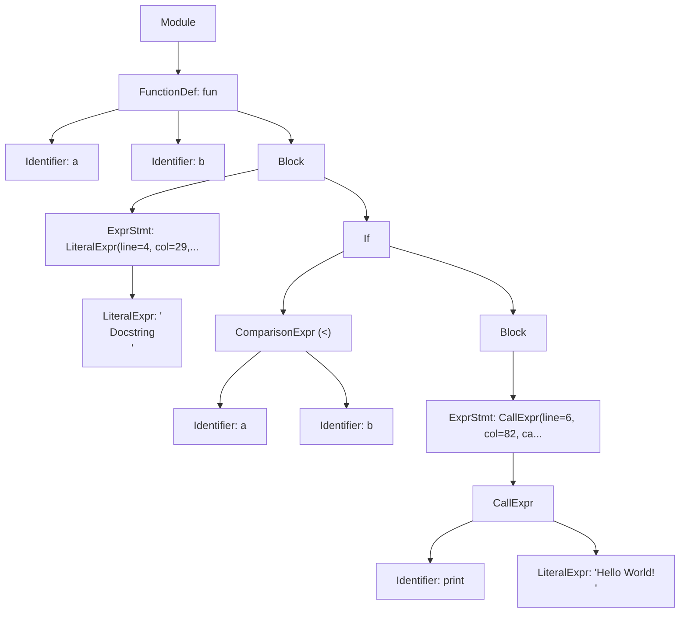

# TransPYler

## 1. Overview

**TransPYler** is a compiler-like project designed to translate a simplified subset of Python, called **Fangless Python**, into another target programming language (to be defined).

The project is divided into multiple stages of compilation:

1. **Lexical Analysis (Lexer)** — ✅ _implemented_
2. **Syntactic Analysis (Parser)** — ✅ _implemented_
3. **Semantic Analysis** — 🚧 _future work_
4. **Transpilation/Code Generation** — 🚧 _future work_

At this stage, the project includes the **Lexer** and **Parser**, which together can scan Fangless Python source code, produce a stream of tokens, and construct an Abstract Syntax Tree (AST) representing the program structure.

---

## 2. Current Status

- **Implemented**:
  - Lexer for Fangless Python using [PLY (Python Lex-Yacc)](https://www.dabeaz.com/ply/)
  - Parser that constructs an AST from tokenized input
  - AST visualization tools (Rich, ASCII diagrams, Mermaid)
- **Pending**: Semantic checks and transpilation to the target language

This README serves as a reference for the full transcompiler. Usage examples and tests cover both the **Lexer** and **Parser** implementations.

---

## 3. Features

### Lexer Features

- Recognizes **keywords** (`if, else, elif, while, for, def, return, class, True, False, None, and, or, not, in, break, continue, pass...`)
- Identifies **identifiers**, **numeric and string literals**, and **operators** (`+, -, *, /, //, %, **, ==, !=, <, >, <=, >=, =, +=, -=, *=, /=, //=, %=, **=...`)
- Supports **delimiters**: `( ) [ ] { } : , .`
- Handles **comments** starting with `#`
- Detects **indentation levels**, generating special tokens `INDENT` and `DEDENT`
- Reports **lexical errors** (unknown characters, invalid escapes, indentation mistakes)

### Parser Features

- Constructs an **Abstract Syntax Tree (AST)** from token streams
- Supports expressions:
  - Literals (numbers, strings, booleans, None)
  - Binary operators (arithmetic, logical, comparison)
  - Unary operators (negation, logical NOT)
  - Data structures (tuples, lists, dictionaries, sets)
  - Function calls, attribute access, subscripting
  - Slicing notation (`[start:stop:step]`)
- Supports statements:
  - Assignments (simple and augmented: `=`, `+=`, `-=`, etc.)
  - Control flow (`if`/`elif`/`else`, `while`, `for`)
  - Function and class definitions
  - `return`, `break`, `continue`, `pass`
- Implements **operator precedence** following Python rules
- Reports **syntax errors** with contextual error messages
- Provides **AST visualization** in multiple formats

---

## 4. Installation

### 4.1 Requirements

- Python 3.x
- Git + GitHub
- PLY (Python Lex-Yacc)
- Rich (optional, for enhanced AST visualization)

### 4.2 Setup

```bash
# Clone the repository
git clone https://github.com/andresquesadag/TransPYler.git
cd TransPYler

# (Optional) virtual environment
python -m venv venv
source venv/bin/activate  # Linux/Mac
venv\Scripts\activate     # Windows

# Install dependencies
pip install -r requirements.txt
```

---

## 5. Usage

### 5.1 Lexer Testing

```bash
python -m src.testers.manual_tester <test> <expect>
```

- **test**: Path to a file containing Fangless Python (.flpy) code for testing
- **expect**: Path to a file containing the expected sequence of tokens

#### Example

**Test (`strings_and_indent.flpy`):**

```python
# Function
def f():
    s1 = "Quote\"mark"
    s2 = 'Back\\slash'
    s3 = ''
    return s1
```

**Expected Tokens (`strings_and_indent.expect`):**

```plain
DEF "def"
ID "f"
LPAREN "("
RPAREN ")"
COLON ":"
INDENT
ID "s1"
ASSIGN "="
STRING "Quote"mark"
ID "s2"
ASSIGN "="
STRING "Back\slash"
ID "s3"
ASSIGN "="
STRING ""
RETURN "return"
ID "s1"
DEDENT
```

**Command:**

```bash
python -m src.testers.manual_tester strings_and_indent.flpy strings_and_indent.expect
```

**Output:**

```plain
✅ Test passed: All tokens match expected output
```

### 5.2 Parser and AST Visualization

The parser can generate and visualize ASTs from Fangless Python source code.

```bash
python -m src.tools.ast_cli [--expr EXPRESSION | --file PATH] [--out JSON_PATH] [--view {expr,generic,diagram,mermaid}] [--unwrap-expr]
```

#### Arguments

- `--expr EXPRESSION`: Parse an inline expression
- `--file PATH`: Parse a source file (.py/.flpy)
- `--out JSON_PATH`: Output path for AST JSON (default: `ast.json` in repo root)
- `--view {expr,generic,diagram,mermaid}`: Visualization format (default: `expr`)
  - `expr`: Expression-focused tree view (requires Rich)
    - **Note**: This view is optimized for pure expressions (e.g., `2 + 3`, `foo(bar)`). When visualizing statements (Module, FunctionDef, Assign, etc.), it falls back to the generic view, so both views will appear identical for full programs.
  - `generic`: Generic AST tree view (requires Rich)
  - `diagram`: ASCII art tree diagram
  - `mermaid`: Mermaid diagram syntax (saved to `.mmd` file)
- `--unwrap-expr`: Return bare expression when input is a single expression
  - Only unwraps when the AST is `Module` → `ExprStmt` → expression. Has no effect on statements like function definitions.

#### Examples

**Parse an inline expression:**

```bash
python -m src.tools.ast_cli --expr "2 + 3 * 4" --view diagram
```

**Parse a file and view as Rich tree:**

```bash
python -m src.tools.ast_cli --file tests/parser/test_parser_ast.flpy --view expr
```

**Generate Mermaid diagram:**

```bash
python -m src.tools.ast_cli --file tests/parser/test_parser_ast.flpy --view mermaid
```

**Parse and save to specific location:**

```bash
python -m src.tools.ast_cli --expr "x = [1, 2, 3]" --out output/my_ast.json
```

#### Views showcase

**Inputted code**

```py
# comment
def fun(a,b):
    """
    Docstring
    """
    if a < b:
        print("Hello World! \n")
```

**Rich AST**


**Mermaid AST**



---

## 6. Project Design

### 6.1 File Structure

```plain
TransPYler/
├── src/
│   ├── core/
│   │   ├── __init__.py
│   │   ├── ast/
│   │   │   ├── __init__.py
│   │   │   ├── ast_base.py
│   │   │   ├── ast_definitions.py
│   │   │   ├── ast_expressions.py
│   │   │   └── ast_statements.py
│   │   ├── symbol_table.py
│   │   └── utils.py
│   │
│   ├── lexer/
│   │   ├── __init__.py
│   │   ├── indentation.py
│   │   ├── lexer.py
│   │   └── tokens.py
│   │
│   ├── parser/
│   │   ├── __init__.py
│   │   ├── parser.py
│   │   ├── parser_blocks.py
│   │   ├── parser_conditionals.py
│   │   ├── parser_definitions.py
│   │   ├── parser_expressions.py
│   │   ├── parser_loops.py
│   │   ├── parser_statements.py
│   │   └── parser_utils.py
│   │
│   ├── testers/
│   │   ├── __init__.py
│   │   ├── lexer/
│   │   └── parser/
│   │
│   ├── tools/
│   │   ├── __init__.py
│   │   ├── ast_cli.py
│   │   └── ast_viewer.py
│   │
│   └── __init__.py
│
├── tests/
│   ├── lexer/
│   └── parser/
│
├── doc/
│   ├── lexer_design.md
│   └── parser_design.md
│
├── .gitignore
├── pytest.ini
├── README.md
└── requirements.txt
```

### 6.2 Lexer Design

[Read about TransPYler's lexer design here](doc/lexer_design.md)

### 6.3 Parser Design

[Read about TransPYler's parser design here](doc/parser_design.md)

---

## 7. Abstract Syntax Tree (AST)

The parser generates an AST that represents the hierarchical structure of Fangless Python programs. The AST consists of various node types:

### Expression Nodes

- `LiteralExpr`: Numeric, string, boolean, and None literals
- `Identifier`: Variable and function names
- `UnaryExpr`: Unary operations (`-x`, `not y`)
- `BinaryExpr`: Binary operations (`x + y`, `a and b`)
- `ComparisonExpr`: Comparison operations (`x < y`, `a == b`)
- `CallExpr`: Function calls (`func(args)`)
- `TupleExpr`, `ListExpr`, `SetExpr`, `DictExpr`: Collection literals
- `Attribute`: Attribute access (`obj.attr`)
- `Subscript`: Subscripting and slicing (`list[0]`, `list[1:5:2]`)

### Statement Nodes

- `Assign`: Assignment statements (including augmented assignments)
- `ExprStmt`: Expression statements
- `Return`: Return statements
- `Break`, `Continue`, `Pass`: Control flow statements
- `If`: Conditional statements with elif and else
- `While`: While loops
- `For`: For loops
- `FunctionDef`: Function definitions
- `ClassDef`: Class definitions
- `Block`: Statement blocks

### Module Node

- `Module`: Top-level container representing a complete source file

---

## 8. Development Workflow

- Code and documentation are written in **English**.
- Git workflow:

  - Branch naming: `TASK_<#>_<BriefDescription>`
  - Contributions via **Pull Requests** only.

- Code must be clean, modular, and documented.

---

## 9. Automatic Testing

### 9.1 Strategy

- Unit tests for token recognition
- Integration tests with Fangless Python snippets
- Error cases: invalid characters, indentation, escape sequences, syntax errors
- Parser tests for AST generation and correctness

### 9.2 Run Tests

This project uses [pytest](https://docs.pytest.org/) for testing.

1. **Install dependencies**  
   Make sure you have installed all requirements first:

   ```bash
   pip install -r requirements.txt
   ```

2. **Run the full test suite**  
   From the project root, run:

   ```bash
   pytest
   ```

   By default, pytest will automatically discover all tests with `test_` in their name.

3. **Run tests with more detailed output**

   ```bash
   pytest -v
   ```

   The `-v` (verbose) flag shows each test name and its result.

4. **Run a specific test file**

   ```bash
   pytest src/testers/test_lexer.py
   ```

5. **Run parser tests specifically**

   ```bash
   pytest src/testers/parser/
   ```

6. **Stop at the first failure**

   ```bash
   pytest -x
   ```

---

## 10. Roadmap

- **Phase 1 — Lexer**: ✅ Completed
- **Phase 2 — Parser**: ✅ Completed
  - AST construction from token stream
  - Support for expressions, statements, and control flow
  - Operator precedence and associativity
  - Error reporting with context
  - AST visualization tools
- **Phase 3 — Semantic Analysis**: 🚧 Planned
  - Type checking
  - Symbol table management
  - Scope analysis
  - Semantic error detection
- **Phase 4 — Code Generation**: 🚧 Planned
  - Translate Fangless Python AST into target language
  - Optimization passes
  - Runtime library integration

---

## 11. References

- [PLY Documentation](https://www.dabeaz.com/ply/)
- [Python 3 Language Reference](https://docs.python.org/3/reference/)
- [Abstract Syntax Trees](https://en.wikipedia.org/wiki/Abstract_syntax_tree)

---

## 12. Authors

| Name                    | Email                          | Role/Contribution                                                                                                            |
| ----------------------- | ------------------------------ | ---------------------------------------------------------------------------------------------------------------------------- |
| Andrés Quesada-González | <andresquesadagon4@gmail.com>  | **Lexer:** Operator and literal token definition, documentation, project structure, test scripts, test cases, python modules |
|                         |                                | **Parser:** Function and Class definitions, Syntax error handling, Mermaid AST viewer, python modules,documentation          |
| David Obando-Cortés     | <david.obandocortes@ucr.ac.cr> | **Lexer:** Indentation Handling, Keywords definition                                                                         |
|                         |                                | **Parser:**                                                                                                                  |
| Randy Agüero-Bermúdez   | <randy.aguero@ucr.ac.cr>       | **Lexer:** Testing, comment handling, Identifier token definition recognition                                                |
|                         |                                | **Parser:**                                                                                                                  |
