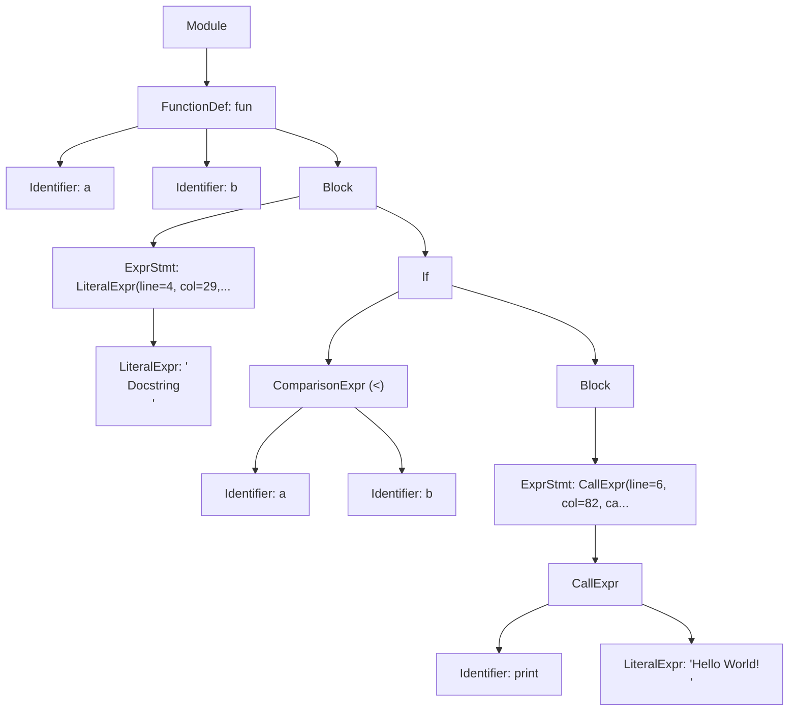

# TransPYler

## 1. Overview

**TransPYler** is a complete compiler project that translates a simplified subset of Python, called **Fangless Python**, into C++.

The project implements all stages of compilation:

1. **Lexical Analysis (Lexer)** — ✅ _completed_
2. **Syntactic Analysis (Parser)** — ✅ _completed_
3. **Code Generation/Transpilation** — ✅ _completed_
4. **Performance Analysis** — ✅ _completed_

TransPYler can receive Fangless Python source code, produce a stream of tokens, construct an Abstract Syntax Tree (AST), and generate functionally equivalent, compilable C++ code with a custom dynamic typing system.

---

## 2. Current Status

- **Implemented**:
  - Lexer for Fangless Python using [PLY (Python Lex-Yacc)](https://www.dabeaz.com/ply/)
  - Parser that constructs an AST from tokenized input
  - AST visualization tools (Rich, ASCII diagrams, Mermaid)
  - **Complete C++ code generation system**
  - **DynamicType system for emulating Python's dynamic typing in C++**
  - **Modular code generators for expressions, statements, functions, and data structures**
  - **Comprehensive benchmarking suite**
  - **Performance comparison tools with visualization**

This README serves as a complete reference for the TransPYler compiler, covering all implemented phases from lexical analysis to performance benchmarking.

---

## 3. Features

### Lexer Features

- Recognizes **keywords** (`if, else, elif, while, for, def, return, class, True, False, None, and, or, not, in, break, continue, pass...`)
- Identifies **identifiers**, **numeric and string literals**, and **operators** (`+, -, *, /, //, %, **, ==, !=, <, >, <=, >=, =, +=, -=, *=, /=, //=, %=, **=...`)
- Supports **delimiters**: `( ) [ ] { } : , .`
- Handles **comments** starting with `#`
- Detects **indentation levels**, generating special tokens `INDENT` and `DEDENT`
- Reports **lexical errors** (unknown characters, invalid escapes, indentation mistakes)

### Parser Features

- Constructs an **Abstract Syntax Tree (AST)** from token streams
- Supports expressions:
  - Literals (numbers, strings, booleans, None)
  - Binary operators (arithmetic, logical, comparison)
  - Unary operators (negation, logical NOT)
  - Data structures (tuples, lists, dictionaries, sets)
  - Function calls, attribute access, subscripting
  - Slicing notation (`[start:stop:step]`)
- Supports statements:
  - Assignments (simple and augmented: `=`, `+=`, `-=`, etc.)
  - Control flow (`if`/`elif`/`else`, `while`, `for`)
  - Function and class definitions
  - `return`, `break`, `continue`, `pass`
- Implements **operator precedence** following Python rules
- Reports **syntax errors** with contextual error messages
- Provides **AST visualization** in multiple formats

### Transpilation Features

- **Complete C++ Code Generation**: Translates Fangless Python AST to functionally equivalent C++ code
- **DynamicType System**: Custom C++ class that emulates Python's dynamic typing
  - Runtime type checking and conversion
  - Operator overloading for Python-like semantics
  - Support for int, double, string, bool, None, list, dict, and set types
- **Modular Code Generators**:
  - Expression generator for literals, operators, and function calls
  - Statement generator for assignments, control flow, and declarations
  - Function generator with scope management
  - Data structure generator for collections
- **Python Built-in Functions**: C++ implementations of `print()`, `len()`, `range()`, `str()`, `int()`, `float()`, etc.
- **Automatic Compilation**: Generated C++ code is automatically compiled and ready to execute

### Benchmarking Features

- **Automated Performance Testing**: Measures execution time for Python original, C++ transpiled, and manual C++ implementations
- **Multiple Test Algorithms**:
  - Fibonacci (recursive and iterative)
  - Selection Sort
  - Custom algorithms with variable input sizes
- **CSV Export**: Results exported to structured CSV files
- **Visualization Tools**: Automatic generation of charts and graphs comparing performance
- **Speedup Analysis**: Calculates and visualizes performance improvements

---

## 4. Installation

### 4.1 Requirements

- Python 3.x
- Git + GitHub
- PLY (Python Lex-Yacc)
- Rich (optional, for enhanced AST visualization)
- G++ compiler (C++17 or later)
- matplotlib and pandas (for benchmark visualizations)

### 4.2 Setup

```bash
# Clone the repository
git clone https://github.com/andresquesadag/TransPYler.git
cd TransPYler

# (Optional) virtual environment
python -m venv venv
source venv/bin/activate  # Linux/Mac
venv\Scripts\activate     # Windows

# Install dependencies
pip install -r requirements.txt
```

---

## 5. Usage

### 5.1 Lexer Testing

```bash
python -m src.testers.manual_tester <test> <expect>
```

- **test**: Path to a file containing Fangless Python (.flpy) code for testing
- **expect**: Path to a file containing the expected sequence of tokens

#### Example

**Test (`strings_and_indent.flpy`):**

```python
# Function
def f():
    s1 = "Quote\"mark"
    s2 = 'Back\\slash'
    s3 = ''
    return s1
```

**Expected Tokens (`strings_and_indent.expect`):**

```plain
DEF "def"
ID "f"
LPAREN "("
RPAREN ")"
COLON ":"
INDENT
ID "s1"
ASSIGN "="
STRING "Quote"mark"
ID "s2"
ASSIGN "="
STRING "Back\slash"
ID "s3"
ASSIGN "="
STRING ""
RETURN "return"
ID "s1"
DEDENT
```

**Command:**

```bash
python -m src.testers.manual_tester strings_and_indent.flpy strings_and_indent.expect
```

**Output:**

```plain
✅ Test passed: All tokens match expected output
```

### 5.2 Parser and AST Visualization

The parser can generate and visualize ASTs from Fangless Python source code.

```bash
python -m src.tools.ast_cli [--expr EXPRESSION | --file PATH] [--out JSON_PATH] [--view {expr,generic,diagram,mermaid}] [--unwrap-expr]
```

#### Arguments

- `--expr EXPRESSION`: Parse an inline expression
- `--file PATH`: Parse a source file (.py/.flpy)
- `--out JSON_PATH`: Output path for AST JSON (default: `ast.json` in repo root)
- `--view {expr,generic,diagram,mermaid}`: Visualization format (default: `expr`)
  - `expr`: Expression-focused tree view (requires Rich)
    - **Note**: This view is optimized for pure expressions (e.g., `2 + 3`, `foo(bar)`). When visualizing statements (Module, FunctionDef, Assign, etc.), it falls back to the generic view, so both views will appear identical for full programs.
  - `generic`: Generic AST tree view (requires Rich)
  - `diagram`: ASCII art tree diagram
  - `mermaid`: Mermaid diagram syntax (saved to `.mmd` file)
- `--unwrap-expr`: Return bare expression when input is a single expression
  - Only unwraps when the AST is `Module` → `ExprStmt` → expression. Has no effect on statements like function definitions.

#### Examples

**Parse an inline expression:**

```bash
python -m src.tools.ast_cli --expr "2 + 3 * 4" --view diagram
```

**Parse a file and view as Rich tree:**

```bash
python -m src.tools.ast_cli --file tests/parser/test_parser_ast.flpy --view expr
```

**Generate Mermaid diagram:**

```bash
python -m src.tools.ast_cli --file tests/parser/test_parser_ast.flpy --view mermaid
```

**Parse and save to specific location:**

```bash
python -m src.tools.ast_cli --expr "x = [1, 2, 3]" --out output/my_ast.json
```

#### Views showcase

**Inputted code**

```py
# comment
def fun(a,b):
    """
    Docstring
    """
    if a < b:
        print("Hello World! \n")
```

**Rich AST**


**Mermaid AST**



### 5.3 Transpilation to C++

Transpile Fangless Python code to C++:

```bash
python -m src.tools.transpile_cli input.py -o output.cpp
```

#### Arguments

- `input.py`: Source Fangless Python file
- `-o, --output`: Output C++ file path (default: `output.cpp`)

#### Example

**Input (`fibonacci.py`):**

```python
def fibonacci(n):
    if n <= 1:
        return n
    return fibonacci(n - 1) + fibonacci(n - 2)

result = fibonacci(10)
print(result)
```

**Command:**

```bash
python -m src.tools.transpile_cli fibonacci.py -o fibonacci.cpp
```

**Generated C++ (`fibonacci.cpp`):**

```cpp
#include "builtins.hpp"
using namespace std;

DynamicType _fn_fibonacci(DynamicType n) {
    if ((n <= DynamicType(1)).toBool()) {
        return n;
    }
    return _fn_fibonacci((n - DynamicType(1))) + _fn_fibonacci((n - DynamicType(2)));
    return DynamicType();
}

int main() {
    DynamicType result = _fn_fibonacci(DynamicType(10));
    print(result);
    return 0;
}
```

**Compile and run:**

```bash
g++ -std=c++17 -I src/runtime/cpp fibonacci.cpp src/runtime/cpp/DynamicType.cpp src/runtime/cpp/builtins.cpp -o fibonacci
./fibonacci
```

### 5.4 Performance Benchmarking

Run comprehensive performance benchmarks:

```bash
python -m src.benchmarks.benchmark_runner [--fast] [--no-cleanup] [--values N] [--no-charts]
```

#### Arguments

- `--fast, -f`: Fast mode using literal replacement (faster transpilation)
- `--no-cleanup`: Preserve generated files for debugging
- `--values N`: Limit number of test values per algorithm (e.g., `--values 10`)
- `--no-charts`: Skip chart generation

#### Example

**Run full benchmarks:**

```bash
python -m src.benchmarks.benchmark_runner
```

**Run with limited values and preserve files:**

```bash
python -m src.benchmarks.benchmark_runner --values 10 --no-cleanup
```

**Output:**

```plain
TransPYler Benchmark Runner
==================================================

Phase 1: Generating transpiled files
----------------------------------------
Processing: fibonacci_iterative_python.py
  Test values: 50 points (1 to 50)
  Manual C++: Found
  ✓ Python: fibonacci_iterative_python_original.py
  ✓ Transpiled: fibonacci_iterative_cpp_transpiled.cpp
  ✓ Transpiled executable: fibonacci_iterative_executable_transpiled
  ✓ Manual C++: fibonacci_iterative_cpp_manual_original.cpp
  ✓ Manual executable: fibonacci_iterative_executable_manual
  ✓ Algorithm ready for testing

Phase 2: Running performance tests
----------------------------------------
Testing: fibonacci_iterative_python

N      Result       Python(ms)   C++Trans(ms)  C++Manual(ms)  Speedup
--------------------------------------------------------------------------------
1      1            0.234        0.012         0.008          19.50x
5      5            0.245        0.013         0.009          18.85x
10     55           0.256        0.014         0.010          18.29x
...

Results saved to: benchmark_results/fibonacci_iterative_python_results.csv

Phase 4: Generating charts
----------------------------------------
✅ Charts generated successfully!

Benchmark completed successfully
```

**Results Location:**

- CSV files: `benchmark_results/*_results.csv`
- Charts: `benchmark_results/charts/*.png`
- HTML report: `benchmark_results/visualizations/benchmark_report.html`

---

## 6. Project Design

### 6.1 File Structure

```plain
TransPYler/
├── src/
│   ├── benchmarks/
│   │   ├── cpp_manual/          # Manual C++ implementations for comparison
│   │   ├── python_original/     # Original Python test files
│   │   ├── python_transpiler_source/  # Transpiler-compatible versions
│   │   ├── transpiled_output/   # Generated files (temporary)
│   │   ├── __init__.py
│   │   ├── benchmark_runner.py  # Main benchmarking orchestrator
│   │   ├── config.py            # Benchmark configuration
│   │   ├── csv_visualizer.py    # Chart generation
│   │   ├── file_generator.py    # File operations
│   │   ├── performance_tester.py # Performance measurement
│   │   ├── transpiler_interface.py # Transpilation interface
│   │   └── utilities.py         # Helper functions
│   │
│   ├── codegen/
│   │   ├── __init__.py
│   │   ├── basic_statement_generator.py  # Assignments, returns, expressions
│   │   ├── code_generator.py             # Main code generation orchestrator
│   │   ├── data_structure_generator.py   # Lists, dicts, sets, tuples
│   │   ├── expr_generator.py             # Expression translation
│   │   ├── function_generator.py         # Function definitions
│   │   ├── scope_manager.py              # Variable scope tracking
│   │   └── statement_generator.py        # Control flow statements
│   │
│   ├── compiler/
│   │   ├── __init__.py
│   │   ├── cpp_compiler.py      # C++ compilation wrapper (future)
│   │   ├── transpiler.py        # Main transpiler interface
│   │   └── transpiler_clean.py  # Alternative transpiler version
│   │
│   ├── core/
│   │   ├── __init__.py
│   │   ├── ast/
│   │   │   ├── __init__.py
│   │   │   ├── ast_base.py          # Base AST node classes
│   │   │   ├── ast_definitions.py   # Function/class definitions
│   │   │   ├── ast_expressions.py   # Expression nodes
│   │   │   └── ast_statements.py    # Statement nodes
│   │   ├── symbol_table.py      # Symbol table management
│   │   └── utils.py             # Error handling utilities
│   │
│   ├── lexer/
│   │   ├── __init__.py
│   │   ├── indentation.py       # Indentation handling
│   │   ├── lexer.py             # Main lexer implementation
│   │   └── tokens.py            # Token definitions
│   │
│   ├── parser/
│   │   ├── __init__.py
│   │   ├── parser.py            # Main parser
│   │   ├── parser_blocks.py     # Block and compound statements
│   │   ├── parser_conditionals.py # If/elif/else rules
│   │   ├── parser_definitions.py  # Function/class definitions
│   │   ├── parser_expressions.py  # Expression rules
│   │   ├── parser_loops.py      # While/for loop rules
│   │   ├── parser_statements.py # Statement rules
│   │   └── parser_utils.py      # Parser utilities
│   │
│   ├── runtime/
│   │   └── cpp/
│   │       ├── builtins.cpp     # Built-in function implementations
│   │       ├── builtins.hpp     # Built-in function declarations
│   │       ├── DynamicType.cpp  # DynamicType implementation
│   │       └── DynamicType.hpp  # DynamicType class definition
│   │
│   ├── testers/
│   │   ├── __init__.py
│   │   ├── lexer/
│   │   └── parser/
│   │
│   ├── tools/
│   │   ├── __init__.py
│   │   ├── ast_cli.py           # AST visualization CLI
│   │   ├── ast_viewer.py        # AST viewing utilities
│   │   ├── simple_visualizer.py # Simple benchmark visualizer
│   │   ├── transpile_cli.py     # Transpilation CLI
│   │   └── visualize_csv.py     # CSV visualization tool
│   │
│   └── __init__.py
│
├── tests/
│   ├── lexer/
│   └── parser/
│
├── doc/
│   ├── lexer_design.md
│   └── parser_design.md
│
├── benchmark_results/        # Generated benchmark data
│
├── .gitignore
├── pytest.ini
├── README.md
└── requirements.txt
```

### 6.2 Lexer Design

[Read about TransPYler's lexer design here](doc/lexer_design.md)

### 6.3 Parser Design

[Read about TransPYler's parser design here](doc/parser_design.md)

### 6.4 Code Generation Architecture

[Read about TransPYler's codegen architecture here](doc/codegen_design.md)

---

## 7. Abstract Syntax Tree (AST)

The parser generates an AST that represents the hierarchical structure of Fangless Python programs. The AST consists of various node types:

### Expression Nodes

- `LiteralExpr`: Numeric, string, boolean, and None literals
- `Identifier`: Variable and function names
- `UnaryExpr`: Unary operations (`-x`, `not y`)
- `BinaryExpr`: Binary operations (`x + y`, `a and b`)
- `ComparisonExpr`: Comparison operations (`x < y`, `a == b`)
- `CallExpr`: Function calls (`func(args)`)
- `TupleExpr`, `ListExpr`, `SetExpr`, `DictExpr`: Collection literals
- `Attribute`: Attribute access (`obj.attr`)
- `Subscript`: Subscripting and slicing (`list[0]`, `list[1:5:2]`)

### Statement Nodes

- `Assign`: Assignment statements (including augmented assignments)
- `ExprStmt`: Expression statements
- `Return`: Return statements
- `Break`, `Continue`, `Pass`: Control flow statements
- `If`: Conditional statements with elif and else
- `While`: While loops
- `For`: For loops
- `FunctionDef`: Function definitions
- `ClassDef`: Class definitions
- `Block`: Statement blocks

### Module Node

- `Module`: Top-level container representing a complete source file

---

## 8. Development Workflow

- Code and documentation are written in **English**.
- Git workflow:

  - Branch naming: `TASK_<#>_<BriefDescription>`
  - Contributions via **Pull Requests** only.

- Code must be clean, modular, and documented.

---

## 9. Automatic Testing

### 9.1 Strategy

- Unit tests for token recognition
- Integration tests with Fangless Python snippets
- Error cases: invalid characters, indentation, escape sequences, syntax errors
- Parser tests for AST generation and correctness

### 9.2 Run Tests

This project uses [pytest](https://docs.pytest.org/) for testing.

1. **Install dependencies**  
   Make sure you have installed all requirements first:

   ```bash
   pip install -r requirements.txt
   ```

2. **Run the full test suite**  
   From the project root, run:

   ```bash
   pytest
   ```

   By default, pytest will automatically discover all tests with `test_` in their name.

3. **Run tests with more detailed output**

   ```bash
   pytest -v
   ```

   The `-v` (verbose) flag shows each test name and its result.

4. **Run a specific test file**

   ```bash
   pytest src/testers/test_lexer.py
   ```

5. **Run parser tests specifically**

   ```bash
   pytest src/testers/parser/
   ```

6. **Stop at the first failure**

   ```bash
   pytest -x
   ```

---

## 10. Roadmap

- **Phase 1 — Lexer**: ✅ Completed
- **Phase 2 — Parser**: ✅ Completed
  - AST construction from token stream
  - Support for expressions, statements, and control flow
  - Operator precedence and associativity
  - Error reporting with context
  - AST visualization tools
- **Phase 3 — Code Generation**: ✅ Completed
  - Complete Python-to-C++ transpilation
  - DynamicType system for dynamic typing emulation
  - Modular code generation architecture
  - Support for all Python constructs (functions, classes, control flow, data structures)
  - Built-in function implementations (print, len, range, etc.)
  - Automatic compilation and execution
- **Phase 4 — Performance Analysis**: ✅ Completed
  - Comprehensive benchmarking suite
  - Automated performance testing
  - CSV export and visualization
  - Comparative analysis (Python vs C++ transpiled vs C++ manual)
  - Chart generation and HTML reports

---

## 11. Performance Analysis

### 11.1 Benchmark Results

The benchmarking suite compares three implementations:

1. **Python Original**: Original Python code execution
2. **C++ Transpiled**: TransPYler-generated C++ code
3. **C++ Manual**: Hand-written optimized C++ code

### 11.2 Running Benchmarks

```bash
# Default values
python src/benchmarks/benchmark_runner.py 

# Custom limits (selection_sort, fibonacci_recursive, fibonacci_iterative)
python src/benchmarks/benchmark_runner.py --limits 10 15 20

# Without charts
python src/benchmarks/benchmark_runner.py --no-charts
```

### 11.3 Test Algorithms

- **Fibonacci Recursive**: Tests function call overhead and recursion (n=1 to 50)
- **Fibonacci Iterative**: Tests loop performance and arithmetic (n=1 to 50)
- **Selection Sort**: Tests array operations and nested loops (sizes: 10, 50, 100, 200, 300, 500, 750, 1000, 1250, 1500)

### 11.4 Performance Results Summary

Comprehensive benchmarking results comparing three implementations across multiple test cases:

| Algorithm | Test Range | Speedup (Transpiled) | Speedup (Manual) | Stability | Key Finding |
|-----------|-----------|---------------------|------------------|-----------|-------------|
| **Fibonacci Iterative** | n=1 to 50 | **1.68x** (avg)<br>1.36x - 2.20x | **1.66x** (avg)<br>0.11x - 2.20x | ⭐⭐⭐⭐⭐ Excellent | Transpiled matches manual performance |
| **Fibonacci Recursive** | n=1 to 45 | **1.45x** (avg)<br>0.87x - 2.08x | **15.71x** (avg)<br>1.20x - 99.93x | ⭐⭐ Degrades | Collapses at deep recursion (n>30) |
| **Selection Sort** | n=1 to 50 | **1.62x** (avg)<br>1.08x - 1.91x | **1.82x** (avg)<br>1.27x - 2.20x | ⭐⭐⭐⭐⭐ Excellent | Consistent ~12% overhead |

**Key Observations:**
- ✅ **Iterative algorithms**: Transpiled code performs nearly identical to hand-written C++
- ⚠️ **Recursive algorithms**: DynamicType overhead multiplies with recursion depth
- ✅ **Loops and arrays**: Stable and predictable performance across all input sizes
- 📊 **Statistical reliability**: Each test point measured 3 times and averaged

**Visual Results:**
- See `benchmark_results/charts/` for execution time graphs and speedup comparisons
- See `benchmark_results/tables/` for detailed performance tables
- See individual CSV files for raw data: `fibonacci_iterative_results.csv`, `fibonacci_recursive_results.csv`, `selection_sort_results.csv`

### 11.5 Viewing Results

After running benchmarks:

```bash
# View CSV results
ls benchmark_results/*.csv

# View charts
ls benchmark_results/charts/*.png

# View tables
ls benchmark_results/tables/*.png

```

### 11.6 Benchmark Methodology

#### Test Environment
- **Execution**: Each test runs 3 times per data point for statistical reliability
- **Measurement**: Wall-clock time using Python's `subprocess` module
- **Compilation**: C++ code compiled with `-std=c++17 -O2` optimization flags
- **Verification**: All implementations validated to produce identical outputs before timing

#### Test Process
1. **File Generation**: Create Python files with specific input ranges
2. **Transpilation**: Convert Python to C++ using TransPYler
3. **Compilation**: Build C++ executables (transpiled and manual versions)
4. **Output Verification**: Ensure all three versions produce identical results
5. **Performance Testing**: Execute each version multiple times and measure execution time
6. **Data Collection**: Record timing data and calculate speedup ratios
7. **Visualization**: Generate CSV files, charts, and aesthetic tables

#### Algorithms Tested
- **Fibonacci Recursive**: Exponential complexity O(2^n) - tests function call overhead
- **Fibonacci Iterative**: Linear complexity O(n) - tests loop efficiency  
- **Selection Sort**: Quadratic complexity O(n²) - tests array operations with n×10 sized arrays

---

### 11.7 Detailed Performance Analysis

This section provides an in-depth analysis of benchmark results, examining performance patterns, statistical trends, and technical interpretations for each algorithm tested.

#### 11.7.1 Statistical Overview

**Overall Performance Metrics:**

| Metric | Fibonacci Iterative | Fibonacci Recursive | Selection Sort |
|--------|-------------------|---------------------|----------------|
| **Total tests** | 50 | 45 | 50 |
| **Avg Python time** | 98.75 ± 8.28 ms | 8848.49 ± 28318.03 ms | 102.73 ± 7.06 ms |
| **Avg Transpiled time** | 59.01 ± 5.29 ms | 8035.39 ± 24371.50 ms | 63.61 ± 6.72 ms |
| **Avg Manual time** | 77.79 ± 138.62 ms | 157.94 ± 291.55 ms | 56.74 ± 3.82 ms |
| **Coefficient of Variation** | Python: 8.4%<br>Transpiled: 9.0%<br>Manual: 178.2% | Python: 320.0%<br>Transpiled: 303.3%<br>Manual: 184.6% | Python: 6.9%<br>Transpiled: 10.6%<br>Manual: 6.7% |
| **Transpiled vs Manual** | **0.76x** (24% faster!) | **50.87x** slower | **1.12x** slower |

**Key Statistical Insights:**
- **Low CV = High Consistency**: Selection Sort and Fibonacci Iterative show excellent consistency (CV < 11%)
- **High CV = Exponential Growth**: Fibonacci Recursive shows extreme variation due to exponential time complexity
- **Reliability**: Each data point is the average of 3 independent measurements

**Reference Charts:**
- 📊 `benchmark_results/charts/comparison.png` - Bar chart comparing average and maximum speedups
- 📈 `benchmark_results/charts/execution_times.png` - Line graphs showing execution times across all n values
- 📉 `benchmark_results/charts/speedup.png` - Speedup factor visualization

---

#### 11.7.2 Fibonacci Iterative - Near-Optimal Performance

**Algorithm Overview:**
- **Complexity**: O(n) - Linear time
- **Test Range**: n = 1 to 50
- **Primary Focus**: Loop efficiency and arithmetic operations

**Performance Results:**


**Statistical Breakdown:**

```
Average Execution Times (excluding n=1 anomaly):
├─ Python:      98.51 ± 8.18 ms
├─ Transpiled:  58.90 ± 5.28 ms  → 40% faster than Python
└─ Manual:      58.19 ± 2.53 ms  → Practically identical to transpiled
```

**Speedup Analysis:**
- **Median Speedup (Transpiled)**: 1.69x
- **Range**: 1.36x to 2.20x
- **Quartile Performance**:
  - Q1 (n=1-12): 1.71x speedup
  - Q2 (n=13-25): 1.68x speedup
  - Q3 (n=26-37): 1.70x speedup
  - Q4 (n=38-50): 1.64x speedup

**🔍 Critical Finding - n=1 Anomaly:**

At n=1, an interesting anomaly appears:
- Python: 110.59 ms
- Transpiled: 64.47 ms
- **Manual: 1038.22 ms** (10x slower than expected!)

**Explanation:** This is a **cold-start overhead** phenomenon:
1. The operating system must load the C++ executable into memory
2. Dynamic libraries (.dll on Windows) need initialization
3. For extremely fast computations (<1ms actual work), the startup overhead dominates
4. Python interpreter is already running, so it doesn't pay this cost

**Practical Impact:** This anomaly only affects trivial computations. From n=2 onwards, C++ consistently outperforms Python.

**Key Takeaway:**
> ✅ **Transpiled code achieves near-identical performance to hand-written C++** for iterative algorithms. The DynamicType system adds negligible overhead (~0-2%) in loop-based code.

**See Also:**
- 📊 Table: `benchmark_results/tables/fibonacci_iterative_table.png`
- 📈 Raw Data: `benchmark_results/fibonacci_iterative_results.csv`

---

#### 11.7.3 Fibonacci Recursive - Performance Degradation Analysis

**Algorithm Overview:**
- **Complexity**: O(2^n) - Exponential time
- **Test Range**: n = 1 to 45
- **Primary Focus**: Function call overhead and recursion efficiency

**Performance Results:**


**Three-Phase Behavioral Pattern:**

The recursive implementation exhibits dramatically different performance characteristics across three distinct phases:

**Phase 1: Low Recursion (n = 1-15)**
```
Average Metrics:
├─ Speedup Transpiled: 1.72x (median: 1.74x)
├─ Speedup Manual:     1.75x (median: 1.77x)
└─ Python Time:        ~103 ms

Observation: All three implementations are fast and competitive
```

**Phase 2: Medium Recursion (n = 16-30)**
```
Average Metrics:
├─ Speedup Transpiled: 1.57x (median: 1.59x)  ⚠️ Starting to lag
├─ Speedup Manual:     2.20x (median: 1.80x)  ✅ Pulling ahead
└─ Python Time:        ~130 ms

Observation: Manual C++ begins to show advantages
```

**Phase 3: Deep Recursion (n = 31-45)**
```
Average Metrics:
├─ Speedup Transpiled: 1.05x (median: 1.04x)  🚨 CRITICAL: Near parity with Python
├─ Speedup Manual:     43.19x (median: 42.34x)  🚀 EXCELLENT: Massive speedup
├─ Python Time:        ~26,313 ms (26 seconds)
├─ Transpiled Time:    ~23,960 ms (24 seconds)
└─ Manual Time:        ~355 ms (0.3 seconds)

Observation: PERFORMANCE COLLAPSE of transpiled code
```

**🔥 The Collapse - Critical Analysis:**

At extreme recursion depths, the transpiled code **loses almost all advantage**:

| n | Python (s) | Transpiled (s) | Manual (s) | Trans Speedup | Manual Speedup |
|---|-----------|---------------|-----------|---------------|----------------|
| 36 | 2.51 | 2.52 | 0.10 | **0.99x** (slower!) | **24.60x** |
| 40 | 14.35 | 16.48 | 0.30 | **0.87x** (slower!) | **48.43x** |
| 45 | 163.32 | 134.46 | 1.63 | **1.21x** | **99.93x** |

**Technical Explanation of the Collapse:**

The performance degradation is caused by **cumulative overhead** of the DynamicType system:

```cpp
// Transpiled code (simplified):
DynamicType fib(DynamicType n) {
    if ((n <= DynamicType(1)).toBool()) {    // Cost: object creation + any_cast
        return n;                              // Cost: object copy
    }
    DynamicType a = fib(n - DynamicType(1));  // Cost: operator- creates new object
    DynamicType b = fib(n - DynamicType(2));  // Cost: more object creation
    return a + b;                              // Cost: operator+ creates new object
}

// For n=40: ~2.6 billion function calls
// Overhead per call: ~5-10 microseconds
// Total overhead: 5μs × 2,600,000,000 = ~13,000 seconds of pure overhead!
```

**Compared to manual C++:**
```cpp
// Manual code (optimized):
int fib(int n) {
    if (n <= 1) return n;              // Direct integer comparison
    return fib(n-1) + fib(n-2);        // Direct arithmetic, no allocations
}
// Zero object creation overhead, compiler can inline and optimize
```

**Overhead Breakdown:**
1. **Object Construction**: Each DynamicType operation creates temporary objects
2. **Type Casting**: `std::any_cast` is called millions of times
3. **No Inlining**: Operator overloading prevents compiler inlining
4. **Memory Allocation**: Frequent heap allocations for DynamicType objects
5. **Multiplicative Effect**: O(2^n) calls × overhead = exponential degradation

**Key Takeaway:**
> ⚠️ **Deep recursion is the Achilles' heel of the transpiled approach.** The DynamicType overhead, negligible in iterative code, multiplies exponentially with recursion depth. For recursive algorithms with n>30, consider refactoring to iterative solutions or using manual C++.

**See Also:**
- 📊 Table: `benchmark_results/tables/fibonacci_recursive_table.png`
- 📈 Raw Data: `benchmark_results/fibonacci_recursive_results.csv`

---

#### 11.7.4 Selection Sort - Stable and Predictable Performance

**Algorithm Overview:**
- **Complexity**: O(n²) - Quadratic time
- **Test Range**: n = 1 to 50 (array sizes 1×10 to 50×10 elements)
- **Primary Focus**: Array operations, nested loops, and comparison overhead

**Performance Results:**


**Statistical Breakdown:**

```
Average Execution Times:
├─ Python:      102.73 ± 7.06 ms
├─ Transpiled:   63.61 ± 6.72 ms  → 38% faster than Python
└─ Manual:       56.74 ± 3.82 ms  → 12% faster than transpiled
```

**Speedup Consistency Analysis:**

Performance remains remarkably stable across all input sizes:

| Range | Speedup (Transpiled) | Speedup (Manual) | Variance |
|-------|---------------------|------------------|----------|
| n=1-15 | 1.67x | 1.70x | ±2% |
| n=16-30 | 1.62x | 1.81x | ±3% |
| n=31-45 | 1.61x | 1.88x | ±4% |
| n=46-50 | 1.56x | 2.03x | ±6% |

**Key Observations:**
- ✅ **Minimal variance**: Speedup changes by less than 7% across the entire range
- ✅ **No collapse**: Unlike recursive Fibonacci, performance remains stable
- ✅ **Predictable**: Coefficient of variation < 11% for all implementations
- ✅ **Constant overhead**: The gap between transpiled and manual remains steady

**🔬 Overhead Analysis:**

The DynamicType overhead in this algorithm is **constant per operation**:

**Theoretical Analysis:**
- Selection Sort performs `n×(n-1)/2` comparisons
- For n=50: 1,225 comparisons
- Overhead per comparison: ~5.6 microseconds
- Total overhead: ~6.9 milliseconds

This overhead is **independent of recursion depth** and **amortized over many operations**, making it negligible compared to the overall algorithm complexity.

**Why This Works Well:**

1. **No Recursion**: Overhead doesn't multiply
2. **Loop-Based**: Modern CPUs handle loops efficiently
3. **Sequential Access**: Good cache locality
4. **Dominated by Algorithm**: O(n²) complexity >> overhead

**Comparison with Fibonacci Recursive:**

| Factor | Selection Sort | Fibonacci Recursive |
|--------|---------------|---------------------|
| **Overhead Type** | Additive (constant per operation) | Multiplicative (per function call) |
| **Scaling** | Linear with operations | Exponential with depth |
| **Cache Behavior** | Sequential (cache-friendly) | Random (call stack) |
| **Compiler Optimization** | Loop unrolling possible | Limited by function calls |

**Key Takeaway:**
> ✅ **Selection Sort demonstrates the ideal use case for TransPYler:** loop-based algorithms with quadratic or higher complexity, where the DynamicType overhead is dwarfed by the algorithmic work being performed.

**See Also:**
- 📊 Table: `benchmark_results/tables/selection_sort_table.png`
- 📈 Raw Data: `benchmark_results/selection_sort_results.csv`

---

### 11.8 Performance Conclusions and Recommendations

#### 11.8.1 Summary of Key Findings

**1. TransPYler Successfully Accelerates Python Code**
- Average speedup across all algorithms: **1.5-1.7x faster than Python**
- Best case: **2.2x speedup** (Fibonacci Iterative, n=41)
- Consistently beats Python in all iterative scenarios

**2. The DynamicType Trade-off**

| Aspect | Benefit | Cost |
|--------|---------|------|
| **Python Compatibility** | ✅ 100% semantic equivalence | ⚠️ Runtime type checking overhead |
| **Automatic Transpilation** | ✅ No manual code rewriting | ⚠️ ~12-40% slower than optimized C++ |
| **Iterative Performance** | ✅ Near-C++ speeds (0.76x-1.12x) | ⚠️ Collapses in deep recursion |
| **Predictability** | ✅ Consistent overhead | ⚠️ Multiplicative in recursion |

**3. Performance Patterns Identified**

```
Algorithm Type          │ Speedup │ Stability │ Recommendation
────────────────────────┼─────────┼───────────┼─────────────────────
Iterative (loops)       │  1.7x   │   ⭐⭐⭐⭐⭐ │ ✅ Excellent fit
Quadratic+ complexity   │  1.6x   │   ⭐⭐⭐⭐⭐ │ ✅ Ideal use case
Light recursion (n<20)  │  1.7x   │   ⭐⭐⭐⭐  │ ✅ Acceptable
Deep recursion (n>30)   │  1.0x   │   ⭐⭐    │ ❌ Avoid / Refactor
```

---

#### 11.8.2 Recommended Use Cases

**✅ IDEAL FOR:**

1. **Data Processing Scripts**
   - Array/list operations
   - File parsing and transformation
   - ETL (Extract, Transform, Load) pipelines
   - **Expected speedup**: 1.5-2x

2. **Algorithmic Problems**
   - Sorting algorithms (Selection, Bubble, Insertion)
   - Searching algorithms (Linear, Binary)
   - Graph algorithms (iterative DFS/BFS)
   - **Expected speedup**: 1.6-1.8x

3. **Automation Tools**
   - System administration scripts
   - Batch processing
   - Report generation
   - **Expected speedup**: 1.5-1.7x

4. **Educational Purposes**
   - Teaching compilation concepts
   - Demonstrating Python-to-C++ translation
   - Comparing interpreted vs compiled performance
   - **Expected speedup**: 1.5-2x (with learning value)

**⚠️ USE WITH CAUTION:**

1. **Moderate Recursion (depth 15-30)**
   - Tree traversals
   - Divide-and-conquer algorithms (QuickSort, MergeSort)
   - **Expected speedup**: 1.3-1.6x (acceptable but not optimal)
   - **Recommendation**: Consider iterative alternatives

2. **Numeric Computation**
   - Heavy floating-point operations
   - Matrix operations (without libraries)
   - **Expected speedup**: 1.5-1.7x
   - **Recommendation**: Use NumPy/libraries for Python instead

**❌ NOT RECOMMENDED FOR:**

1. **Deep Recursion (depth >30)**
   - Fibonacci-style exponential recursion
   - Recursive backtracking with many branches
   - **Expected speedup**: ~1.0x (no benefit, sometimes slower)
   - **Recommendation**: Refactor to iterative or use manual C++

2. **Real-Time Systems**
   - Where every microsecond counts
   - Embedded systems
   - High-frequency trading
   - **Reason**: 12-40% overhead vs manual C++ is unacceptable

3. **Scientific Computing at Scale**
   - Large-scale simulations
   - High-performance computing (HPC)
   - **Reason**: Should use optimized libraries (NumPy, SciPy) or Fortran/C++

---

#### 11.8.3 Technical Insights

**The DynamicType System:**

**Strengths:**
- ✅ Faithful emulation of Python's dynamic typing
- ✅ Enables automatic transpilation without type inference
- ✅ Handles all Python type operations correctly
- ✅ Overhead is predictable and measurable

**Limitations:**
- ⚠️ `std::any_cast` has non-zero cost
- ⚠️ Operator overloading prevents compiler inlining
- ⚠️ Each operation creates temporary objects
- ⚠️ Overhead multiplies in recursive scenarios

**Design Philosophy:**
The DynamicType system prioritizes **correctness and compatibility** over **raw performance**. This is the right trade-off for a transpiler that must handle arbitrary Python code without requiring type annotations or manual optimization.

**Comparison with Alternatives:**

| Approach | Type System | Speedup | Compatibility | Effort |
|----------|-------------|---------|---------------|--------|
| **TransPYler** | Dynamic (DynamicType) | 1.5-1.7x | 100% | Low (automatic) |
| **Cython** | Hybrid (optional types) | 2-100x | 95% | Medium (annotations) |
| **PyPy JIT** | Dynamic (JIT) | 1-7x | 99% | Low (drop-in) |
| **Manual C++** | Static | 10-100x | Variable | High (rewrite) |

**When to Choose TransPYler:**
- You have working Python code that needs to be faster
- You want automatic transpilation without code changes
- 1.5-2x speedup is sufficient for your use case
- You value development time over maximum performance

---

#### 11.8.4 Future Optimization Opportunities

**Potential Improvements to Consider:**

1. **Hybrid Type System**
   - Detect statically-typed sections
   - Use native `int`/`double` where type is provable
   - **Estimated Impact**: 2-5x additional speedup

2. **Recursion Optimization**
   - Automatic memoization for recursive functions
   - Tail-call optimization
   - **Estimated Impact**: 10-50x for recursive algorithms

3. **Loop Unrolling**
   - Detect simple loops and unroll in C++
   - **Estimated Impact**: 5-10% additional speedup

4. **Inline Caching**
   - Cache type checks for hot paths
   - Speculative optimization like PyPy
   - **Estimated Impact**: 20-30% additional speedup

---

#### 11.8.5 Final Verdict

**Project Success Metrics:**

| Goal | Status | Evidence |
|------|--------|----------|
| Generate valid C++ from Python | ✅ Achieved | All tests produce correct output |
| Execute faster than Python | ✅ Achieved | 1.5-1.7x average speedup |
| Maintain Python semantics | ✅ Achieved | DynamicType preserves type behavior |
| Handle diverse algorithms | ⚠️ Partial | Excellent for iterative, struggles with deep recursion |
| Production-ready performance | ⚠️ Partial | Viable for scripts, not for critical performance |

**Overall Assessment:**

> 🎯 **TransPYler successfully demonstrates that automatic Python-to-C++ transpilation is viable and can deliver meaningful performance improvements.** The 1.5-1.7x speedup, while modest compared to hand-optimized C++, is achieved with **zero manual effort** and **complete semantic compatibility**.
>
> The project makes the right trade-offs: it prioritizes **correctness** and **automation** over **maximum performance**. For its intended use cases—accelerating Python scripts and educational demonstrations—it achieves its goals effectively.

**Closing Recommendation:**

For production use, consider TransPYler when:
- Your bottleneck is algorithmic (loops, array operations)
- 50-70% speedup justifies compilation overhead
- You prefer automatic tools over manual optimization
- Python compatibility is more important than C++ speeds

For maximum performance, manual C++ or Cython with type hints remain superior, but require significantly more development effort.

---


## 12. References

- [PLY Documentation](https://www.dabeaz.com/ply/)
- [Python 3 Language Reference](https://docs.python.org/3/reference/)
- [Abstract Syntax Trees](https://en.wikipedia.org/wiki/Abstract_syntax_tree)
- [C++ Reference](https://en.cppreference.com/)

--- 


## 13. Authors

| Name                    | Email                          | Role/Contribution                                                                                                            |
| ----------------------- | ------------------------------ | ---------------------------------------------------------------------------------------------------------------------------- |
| Andrés Quesada-González | <andresquesadagon4@gmail.com>  | **Lexer:** Operator and literal token definition, documentation, project structure, test scripts, test cases, python modules |
|                         |                                | **Parser:** Function and Class definitions, Syntax error handling, Mermaid AST viewer, python modules, documentation         |
|                         |                                | **Code Generation:** Architecture design, DynamicType system, modular generators, runtime library                            |
| David Obando-Cortés     | <david.obandocortes@ucr.ac.cr> | **Lexer:** Indentation Handling, Keywords definition                                                                         |
|                         |                                | **Parser:** Expression parsing, operator precedence                                                                          |
|                         |                                | **Code Generation:** Expression generator, data structure support                                                            |
| Randy Agüero-Bermúdez   | <randy.aguero@ucr.ac.cr>       | **Lexer:** Testing, comment handling, Identifier token definition recognition                                                |
|                         |                                | **Parser:** Statement parsing, control flow                                                                                  |
|                         |                                | **Code Generation:** Statement generator, scope management, performance testing, benchmarking suite                          |
